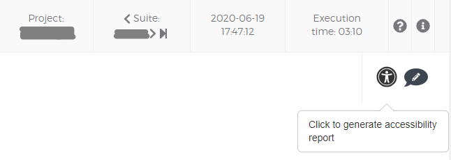
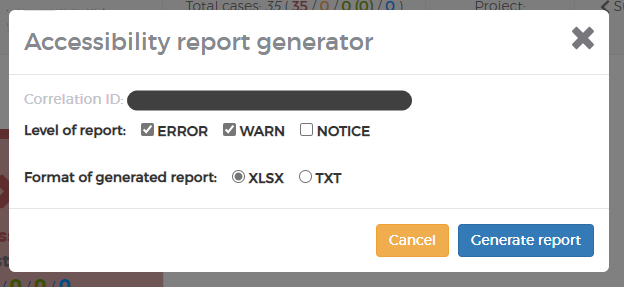

#### Accessibility Issues Report

This feature allows to generate a summary of various reported accessibility issues for a given suite.

You can access it either through the web GUI, or query the report generation endpoint directly (for integration with build tools like Jenkins, Bamboo, ...).

You can choose between two output file formats:
- XLSX (Excel) - gives a summary of all issues by given type in a table format
- TXT (pure text) - targetted as a helper for reporting these issues in JIRA (is already formatted for copy-paste)

##### How it works

This functionality is entirely dependent on the availability of the accessiblity data in a given suite.
The option to generate report will not be available if a given suite doesn't have any accessibility collectors and comparators configured
(see [AccessibilityCollector] and [AccessibilityComparator] for information on how to do it).

You can choose the verbosity of the report (issue severity, what kind will be reported in the result):
- NOTICE
- WARNING
- ERROR

If there are no issues of a given type, the report will be empty, but will still be generated.

In most cases, a likely resolution for a given issue type will be provided.

##### What it does/doesn't do - things to be aware of

- Allow to generate report for a given test or url (currently, whole suite only)

##### Generating report

You have two ways of generating the report: through web GUI, or through dedicated rest endpoint. GUI also uses the endpoint under the hood.

###### GUI

In the right-top corner of the suite view you'll see a button:

_Please note that if the suite doesn't have any type of accessibility comparisons, or if you are not in the suite view, the button will be greyed out._

After clicking on it you will be presented with following window:

You can choose the report verbosity level and output format.

After clicking on "Generate report", a new tab will open, and the report will start downloading to your computer. 

###### Endpoints

**Downloading the report**

URL is as follows:

`<domain>/api/accessibility/report?company=<company>&project=<project>&suite=<suite>&correlationId=<correlationId>&type=<type>&extension=<type>`

Where:
- `domain`: domain on which AETs are set up (eg. `localhost`)
- `company`, `project`, `suite`, `correlationId`: for these the report will be generated, if available
- `type`: verbosity level of the report (`NOTICE`, `WARNING`, `ERROR`)
- `extension`: type of the report (`xlsx` or `txt`)

**Querying for report availability**

You can also query for the availability of the report under URL:

`<domain>/api/accessibility/report/available?company=<company>&project=<project>&suite=<suite>&correlationId=<correlationId>`

(Parameters are the same as described above)

The response will be a JSON with a single key `isAvailable` and a boolean value under it:  
`{"isAvailable":true}`

_Be aware that this does not check if there is actual data for this specific `correlationId`, and the report might be empty._
