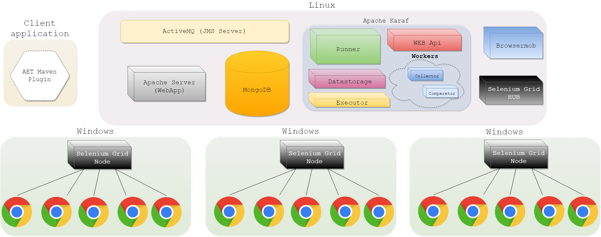

### Advanced Setup

This section describes advanced setup of AET using Linux and Windows. 

Please note that full list of required tools and its versions can be found in [[System Components|SystemComponents]] section.



#### Linux Setup

For Linux environment setup, use the [AET Cookbook](https://github.com/Cognifide/aet-cookbook) which provides following services:
* Karaf with AET service running
* MongoDB as the database
* ActiveMQ as the message broker
* BrowserMob as the proxy server
* Selenium Grid Hub (that later Windows nodes will be attached to)
* Apache Server with the Report app

#### Windows Setup

**Prerequisites**
 * [Chrome browser](https://www.google.com/chrome/browser/desktop/) 
 * [ChromeDriver](https://sites.google.com/a/chromium.org/chromedriver/downloads) (at least version 2.40)
 * [Selenium Standalone Server](http://www.seleniumhq.org/download/) (at least version 3.41)

**Start Selenium Grid node**

Run following command to start selenium grid node process on windows machine:
```
java -Dwebdriver.chrome.driver="<path/to/chromedriver>" -jar <path/to/selenium-server-standalone.jar> -role node -hub http://<linux-ip>:4444/grid/register -browser "browserName=chrome,maxInstances=20" -maxSession 20
```
> Running the selenium grid node process as a Windows service is not recommended - it's causing some 
issues for driver which runs Chrome in headless mode. However this issue does not occur if you 
configure the node process as a Windows startup program.

**Optional Software**

On Windows you can also install [Baretail](https://www.baremetalsoft.com/baretail/) and [Notepad++](https://notepad-plus-plus.org/download/) for viewing logs and configuration files.

#### OSGi Configuration

This section describes how to configure the AET OSGi services so that they could connect to the appropriate system components.
The services are configured through the Karaf Web Console which is hosted on Linux machine. Assuming that this machine's IP address is `192.168.0.1`, 
the Karaf console is available under following address: http://192.168.0.1:8181/system/console/configMgr.

##### Connections configuration

Assuming that most of the system components are running on a single machine 
(e.g. provisioned by [AET Cookbook](https://github.com/Cognifide/aet-cookbook)) then those 
components can work correctly either with default `localhost` configurations,
or with a configuration that points to Linux machine IP.
Those configurations are:
* ActiveMQ broker URL in `AET JMS Connection`
* ActiveMQ JMX endpoint UR in `Messages Manager Configuration`
* Mongo URI property in `AET MongoDB Client`
* Selenium Grid URL property in `AET Chrome WebDriver Factory`

OSGi configurations which need to be configured with environment-specific values are:
* `AET Rest Proxy Manager` - the `server` property needs to be set to IP address of the Linux machine. This address is used
by the Selenium Grid nodes and needs to be accessible for the Windows machine(s).
* `AET Report Application Configuration` - the `reportDomain` property should be set to a domain 
of Apache server which hosts the AET Report application - e.g. `http://aet-report`

##### Collectors and comparators configuration

 The services are **AET Collector Message Listener** and **AET Comparator Message Listener**. There must be at least one of each of those services configured. Below there are listed the properties of each of above mentioned services with required values.

###### AET Collector Message Listener

| Property name | Value |
| ------------- | ----- |
| Collector name | Has to be unique within Collector Message Listeners. |
| Consumer queue name | Fixed value `AET.collectorJobs` |
| Producer queue name | Fixed value `AET.collectorResults` |
| Embedded Proxy Server Port | Has to be unique within Collector Message Listeners. |

###### AET Comparator Message Listener
| Property name | Value |
| ------------- | ----- |
| Comparator name | Has to be unique within Comparator Message Listeners. |
| Consumer queue name | Fixed value `AET.comparatorJobs` |
| Producer queue name | Fixed value `AET.comparatorResults` |

##### Chrome options configuration

The `AET Chrome WebDriver Factory` component configuration (`chromeOptions` property) allows you to configure a list of options/arguments 
which will be passed to the Chrome browser binary. The default list of Chrome options is: `--disable-plugins`, `--headless`, `--hide-scrollbars`, `--disable-gpu`.