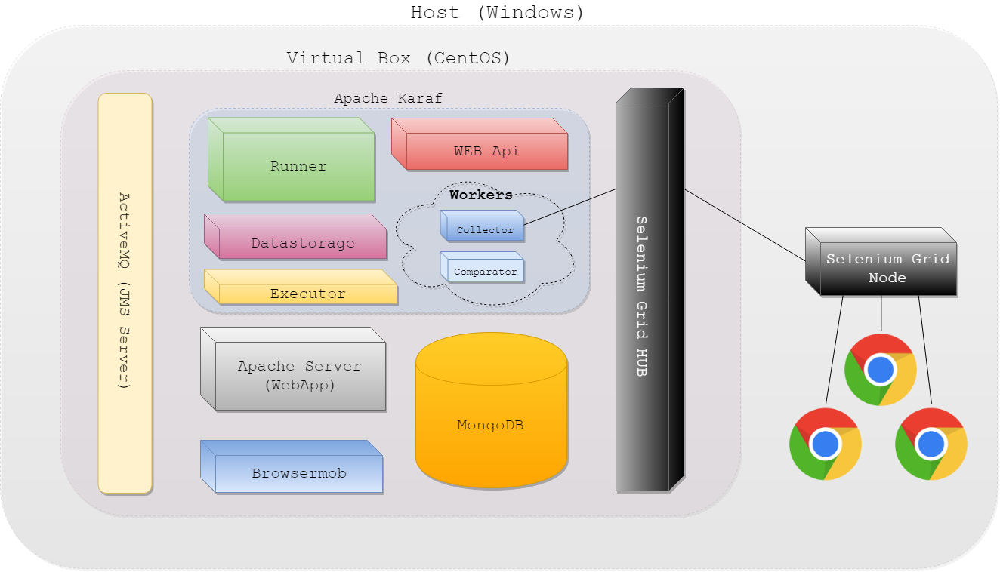

### Basic Setup

This setup makes use of the Vagrant module, a pseudo-cookbook which is responsible for local environment provisioning using Vagrant (powered by Chef + Berkshelf under the hood).

#### Overview

Currently a virtual machine with the following services is created:
* Karaf
* Apache
* Tomcat
* ActiveMQ
* MongoDb
* Browsermob
* Selenium Grid hub



All services run using default ports. For communication please use the following IP address:
* `192.168.123.100`

#### Prerequisites

By default the Vagrant virtual machine needs 6 GB of RAM and 4 vCPUs, so please make sure that
you have enough memory on your machine (16 GB is recommended).

You need to download and install the following software:
   * [VirtualBox 5.2.18](https://www.virtualbox.org/wiki/Downloads)
   * [Vagrant 2.1.2](https://releases.hashicorp.com/vagrant/)
   * [ChefDK 3.1.0](https://downloads.chef.io/chefdk/stable)
   * [JDK 8](http://www.oracle.com/technetwork/java/javase/downloads/jdk8-downloads-2133151.html)
   * [Chrome browser](https://www.google.com/chrome/browser/desktop/) to view reports
   * [ChromeDriver](https://sites.google.com/a/chromium.org/chromedriver/downloads) (at least version 2.40)
   * [Selenium Standalone Server](http://www.seleniumhq.org/download/) (at least version 3.41)
   * [Maven](https://maven.apache.org/download.cgi) (at least version 3.0.4; for development only)


#### Set up Vagrant

Open a command prompt **as the administrator** and execute the following commands:
* `vagrant plugin install vagrant-omnibus`
* `vagrant plugin install vagrant-berkshelf`
* `vagrant plugin install vagrant-hostmanager`

> Note Whenever you'd like to keep all Vagrant related data and virtual machine disks in non-standard directories please
 set the `VAGRANT_HOME` variable for the location (by default it is set to `$HOME/vagrant.d`) and
 update VirtualBox settings (`File -> Preferences -> General`) to move all disks to other directory.

Download or clone (`git clone git@github.com:Cognifide/aet.git`) the AET source code and navigate to the `vagrant` module directory.
Execute following commands to start the virtual machine (this process may take a few minutes):
* `berks install` - downloads Chef dependencies from external sources. It acts as `mvn clean install`, but for Chef cookbooks.
* `berks update`
* `vagrant up` - creates a new virtual machine (the `.box` file will be downloaded during the first run), runs Chef inside it, sets domains and port forwarding up.

See [Vagrant README](https://github.com/Cognifide/aet/blob/master/vagrant/README.md) file
for more Vagrant details, useful commands, etc.

#### Set up Selenium Grid node

When your Vagrant virtual machine is up and running, you need to start a Selenium Grid node process
to be able to run AET suites. To start the node process on your host machine (e.g. Windows):
```
java -Dwebdriver.chrome.driver="<path/to/chromedriver>" -jar <path/to/selenium-server-standalone.jar> -role node -hub http://192.168.123.100:4444/grid/register -browser "browserName=chrome,maxInstances=20" -maxSession 20
```
> Note: `192.168.123.100` is Vagrant IP

Go to [Selenium Grid Console](http://192.168.123.100:4444/grid/console) and check if Chrome WebDrivers are available

#### Troubleshooting

See [[Troubleshooting|Troubleshooting]] page.