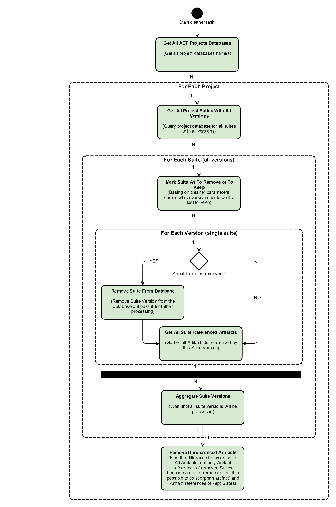
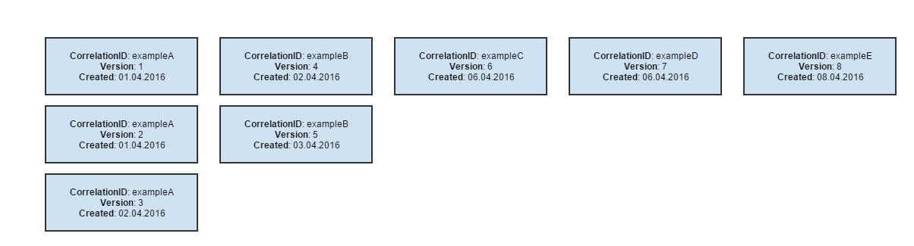
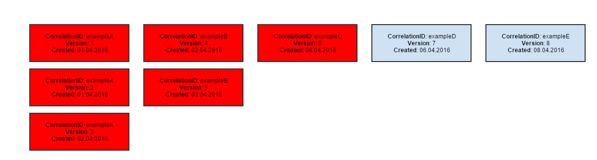

### Cleaner

The Cleaner is a mechanism that removes obsolete data from the AET Database.

The Cleaner is a scheduled task (using the Quartz Scheduler library with a [Cron expression](https://docs.oracle.com/cd/E12058_01/doc/doc.1014/e12030/cron_expressions.htm)). There may be multiple Cleaner instances running in the system, however it is recommended that they should not run over the same span of time (scheduled hours should be carefully picked).

#### Configuration

There are two parameters that define if the Suite in the AET Database is obsolete:

* version,
* creation timestamp.

The **Version** of the suite is incremented each time the suite changes (e.g. during the next run of all suite tests or simply during suite rebasing/commenting). In case when the suite is run with all tests, `correlationId` of the suite changes. During rebasing/commenting, only the version is incremented, `correlationId` remains unchanged.

The **Creation timestamp** is the time when the suite was run or when it was changed last time.

Those parameters can be set in the Cleaner configuration:

* Last N versions to keep - defines the number of artifact versions that will be left after the cleaning operation. If left empty, only one version will be kept after the cleaning operation.
* Remove artifacts older than X days - defines how old files should be removed (older than X days). Works as a conjunction with last versions to be kept.

#### Workflow

The Cleaner makes use of Apache Camel as an execution processor. The following diagram shows a sample Cleaner execution:

#### Examples

Let's assume we have the following suite versions in the database before running the Cleaner.

##### #1

After running the Cleaner with the following parameters:

* remove all suites but for the last 3 versions,
* remove all suites created before 5 days since now (assume now is 08.04.2016, so 5 days since now is 03.04.2016).

The following suites will be removed (marked red).

##### #2

After running the Cleaner with the following parameters:

* remove all suites but for the last 2 versions,
* remove all suites older than 6 days (since 08.04.2016, which is 02.04.2016).

the following suites will be removed (marked red).

##### #3

After running the Cleaner with the following parameters:

* remove all suites but for the last 2 versions,
* no date specified.

The following suites will be removed (marked red).

