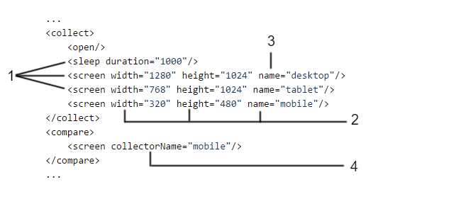

### Collectors

Collector is module which main task is to collect data from tested pages.

Each collector presented in section below consist of two elements:

* module name (produced resource type),
* parameters.

##### Module name (produced resource type)

This name is unique identifier of system functionality. Each collector has its unique name, this name should be also unique for all modules in *[[collect|SuiteStructure#collect]]* phase. This is always name of tag definition for collector.

AET System does not know what work will be performed by collector when it reads suite definition. The only thing that is known is **module name**. System will recognize which collector should be called by matching definition from *[[collect|SuiteStructure#collect]]* phase with name registered in system. When no collector in system with defined name is found, system exception will occur and test will be not performed. This solution enables adding new features to the system without system downtime (just by installing new feature bundle).

Each collector produces resource of defined type. This type can be later recognized by [[comparators |Comparators]] and [[data filters|DataFilters]]. Two collectors can't produce data with the same resource type. **Produced resource type is always equal to collector module name.**

##### Parameters

This is set of key-value pairs using which user can pass some configuration and information to collector. Parameters for collectors are usually not mandatory - passing this parameter is not obligatory, usually this is some collector functionality extension. However, there is one special property: **name**. Collector with set name can be treated in special way by [[comparators|Comparators]] (some comparators may look only for collection results from specifically named collectors), example:

```xml
...
<collect>
  <open/>
  <sleep duration="1000"/>
  <screen width="1280" height="1024" name="desktop"/>
  <screen width="768" height="1024" name="tablet"/>
  <screen width="320" height="480" name="mobile"/>
</collect>
<compare>
  <screen collectorName="mobile"/>
</compare>
...
```

During collect phase, three screenshot with different resolutions will be taken and saved to database. However, only one of them (*mobile*) will be compared with pattern during comparison phase and presented on report (under "*Layout For Mobile*" section).

##### Definitions illustration

Following picture presents elements described earlier:



where:

1. Module name (produced resource type),
2. Parameters,
3. Special collector property: name,
4. Special comparator property: collectorName.
