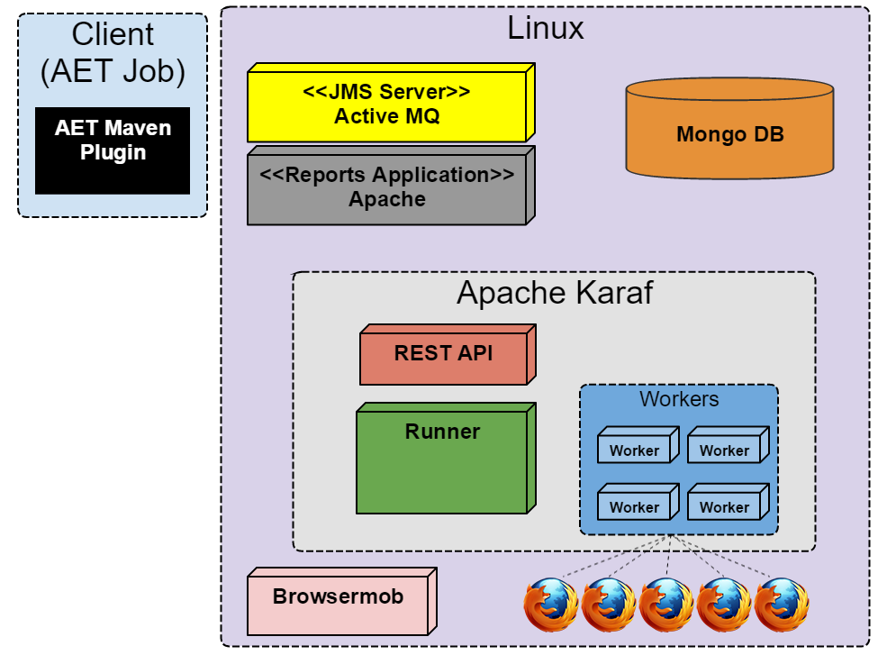

## Environment Setup

There are two ways to setup the AET environment: basic and advanced.

##### basic

The basic setup makes use of [Vagrant](https://www.vagrantup.com/) to create a single virtual machine running Linux OS (currently CentOS 6.7). This virtual machine contains all AET services as well as all the software required to run them. In this configuration, tests are using a Linux version of the Firefox web browser. Please note that there are differences in web page rendering between Linux and Windows versions of Firefox and if you want to use its Windows version then you must refer to the advanced setup.

See **[[Basic Setup|BasicSetup]]** for more details.

The diagram below shows the basic AET setup.

##### advanced

The advanced setup on the other hand makes use of two machines - one running a Linux OS and the other one running Windows, both complementary to each other. The linux machine hosts services such as MongoDB and ActiveMQ whereas the Windows machine hosts Karaf, the Browsermob proxy and Firefox. In this configuration tests run on a Windows version of the Firefox web browser.

See **[[Linux and Windows Setup|LinuxAndWindowsSetup]]** for more details.

The diagram below shows the advanced AET setup.

