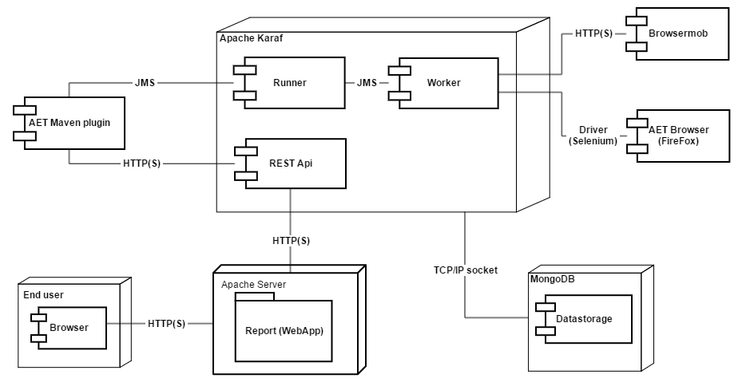

# How It Works
AET is a distributed system that consists of a set of modules deployed on 
[Apache Karaf](http://karaf.apache.org/) which communicate with one another using JMS Server - [Active MQ](http://activemq.apache.org/).
The data collected and results of test processing are saved into the Datastorage (its current implementation is [MongoDB](https://www.mongodb.com/)).
Additionally, AET makes use of [Browsermob](http://bmp.lightbody.net/) as a requests proxy server and [Apache Server](https://httpd.apache.org/) as a host server
for [[Reports Web Application|SuiteReport]].

The diagram below depicts the AET system and communication between AET system components:

#### Third-party software used by system
AET makes use of the following third party software as parts of the system:

| Software | Used version | Function |
| --------- | ----- | ----------- |
| [Apache ActiveMQ](http://activemq.apache.org/) | 5.15.2 | JMS Sever used for communication between system components |
| [Apache Karaf](http://karaf.apache.org/) | 4.2.0 | OSGi container for AET bundles and REST API |
| [Apache Server](https://httpd.apache.org/) | 2.2.15 | Http server used to host [[Reports Web Application|SuiteReport]] |
| [Browsermob](http://bmp.lightbody.net/) | 2.1.4 | Proxy server |
| [Firefox](https://ftp.mozilla.org/pub/firefox/releases/38.6.0esr/win32/en-US/) | 38.6.0 ESR (en-US) | 	Browser with Selenium (3.8.1) |
| [MongoDB](https://www.mongodb.com/) | 3.2.3 | 	System database |
