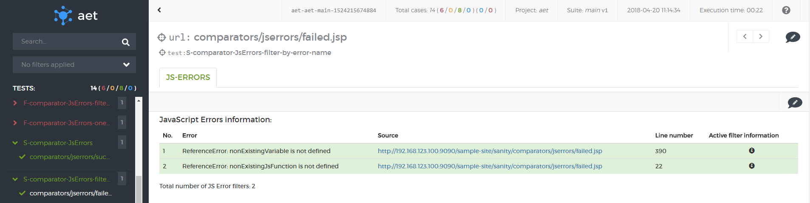
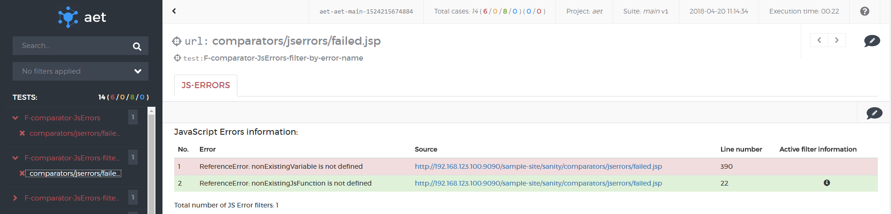
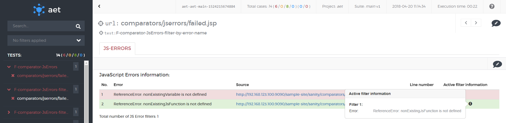

#### JS Errors

##### Description
This case displays success status when there were no JS errors found.

All errors filtered with [JS Errors Data Filter](JSErrorsDataFilter) are marked as ignored (green)
and have associated information about applied filter.

Otherwise the report is marked as risk (red) when at least one not filtered error has been found.

Information about applied filter is shown after clicking on 'i' icon

##### What vulnerabilities it discovers
* JS Errors can cause improper behaviour of a page (e.g. dynamic components may not work properly in some (or even all) browsers,
* JS Error can also occur when good practices are not followed in the javascript code.