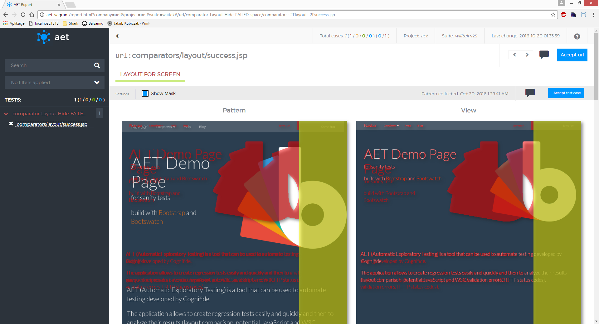
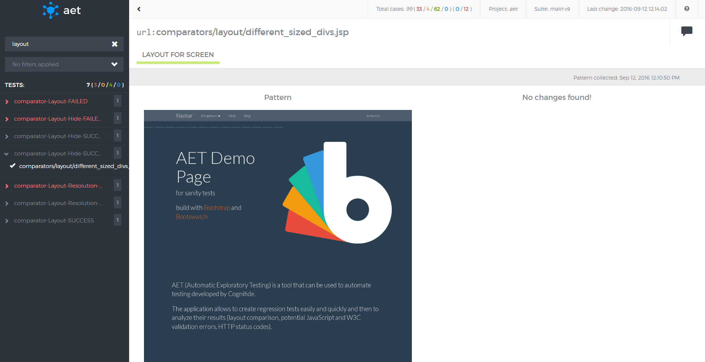
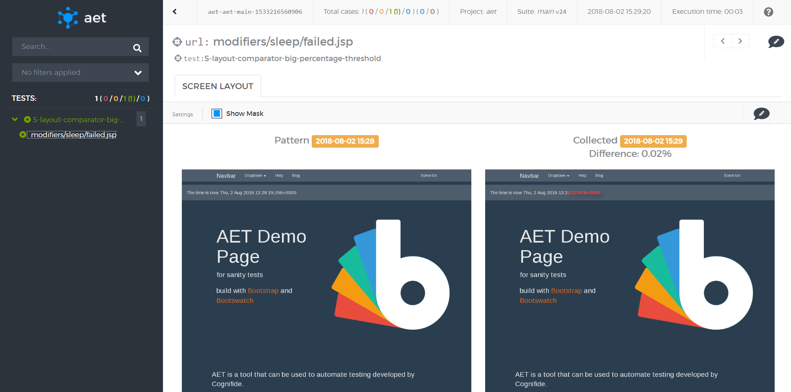

#### Screen - layout

##### Description

For layout tests the results are presented as compared screenshots


1. Test case's name (red font means failure).
2. "Accept test case" button (available only when differences have been detected).
3. "Show mask" switch - when the mask is on, differences are marked in a red colour over the collected screenshot, otherwise a raw screenshot is presented.
4. Pattern - a screen which the "view" is compared to (if there is no pattern, the first collected screenshot is saved as the pattern).
5. View - a screen that was taken during the test and it is compared to the pattern.
6. Example of difference area.
7. Date of obtaining current pattern.

##### Yellow color

Yellow color in mask is introduced when there is a change in test definition.
The yellow color shows that we have different resolutions for pattern and collected view.

In this example pattern has resolution *800x600*, but then test definition for view has been increased using resolution modifier:
```
<resolution width="1024" height="768" />
```



##### Success

Test case's result is marked as successful when there is no difference between view and pattern (see screenshot below).



##### Conditionally passed

Test case's result is marked as conditionally passed when there is difference between view and pattern (see screenshot below) but the difference is below threshold - here `percentageThreshold="5"`. The test is pass so you can't accept it, therefore "Accept test case" button isn't available and the test has green color (but with different icon to be perceptible) but images are different so you can see a mask.



##### What vulnerabilities it discovers
* Differences found in page screenshots may indicate undesired changes in the page layout (css, html structure) e.g. when a new functionality was implemented 
in a system it may have an impact on another system component(s). This may show itself as a changed page layout.
* Content changes can be divided into two groups: wanted (are intended) and unwanted (a result of a mistake or an error). 
An example of a change that is not a defect (wanted) is: the carousel component with the latest news items displayed or the twitter component displaying latest tweets. 
In order to avoid detecting these sorts of changes in these dynamic components, the user can use the [[Hide Modifier|HideModifier]] feature in the suite definition. 
Another example of the ‘wanted’ dynamic content is a cookies policy popup that may be hidden using the [[Cookie Modifier|CookieModifier]].
