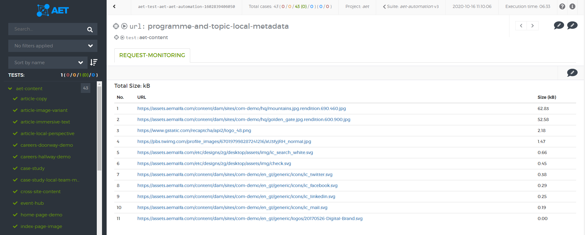

#### Request Monitoring

##### Description

This case displays responses size for the requests that match the given [regexp](RequestMonitoringCollector)

If the amount of the transferred data is bigger than the [maxSize](RequestMonitoringComparator) parameter, the test will fail.