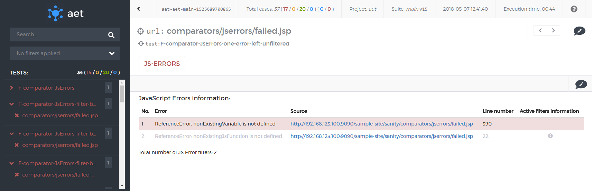
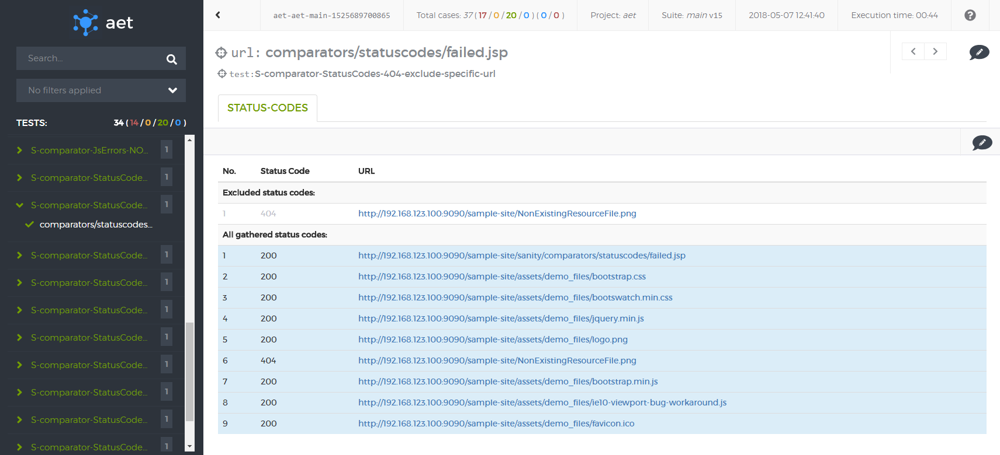

#### Status codes

##### Description
In this test case you can check response codes from certain URLs. There is possibility of excluding individual codes, URLs and patterns (they are ignored by that test) 
as well as including them (only them will be tested by that test). For more information about excluding/including see [[Status Codes Data Filters|StatusCodesDataFilters]].

If any code is filtered by certain test, the result is failure (see screenshot below).

Otherwise test's result is successful (like on the screenshot below).

Additionally, if [[excluding filter|StatusCodesDataFilters]] is used, excluded codes are presented in additional section.

##### What vulnerabilities it discovers
* All status codes with a number higher than 400 are potential errors and indicate that the resource that is used by a page is unreachable (e.g. a page logo image, a page layout css file)
* Status code errors affect SEO (e.g. google page ranking is lowered for pages with 404 status codes).
