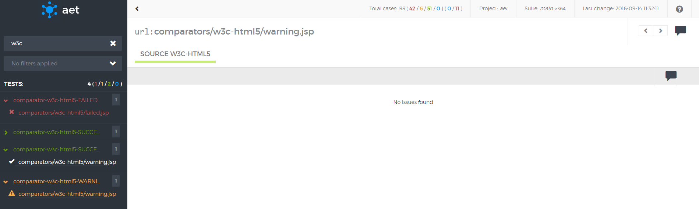

#### W3C (HTML5)
##### Description
| ! Important information |
|:----------------------- |
|W3C validator is compatible with HTML5 standard. |
W3C report results display page source W3C validation output. If no W3C errors were found, result is marked as success - green (see screenshot bellow).

There is possibility to see warning (yellow), if W3C warnings were present and parameter `ignore-warnings` was set to false (as on screenshot bellow).

If at least one W3C validation error was found, report is marked as risk - red (see screenshot bellow).

Result shows total count of validation errors and validation warnings.

##### What vulnerabilities it discovers
* The W3C validation is important from the SEO point of view. Pages that do not comply to  W3C standards are ranked low in Google PageRank and other rankings.
* Detected W3C errors may indicate serious html structure bugs (e.g. tags that haven't been closed) or content issues (e.g. invalid tags parameters: `<a>` without href).
* Maintenance of pages that follow W3C standards is much easier to carry out because pages that keep these standards are much less prone to be displayed differently in different browsers or devices.
* The W3C validation can also reveal page encoding and special characters displaying issues.
