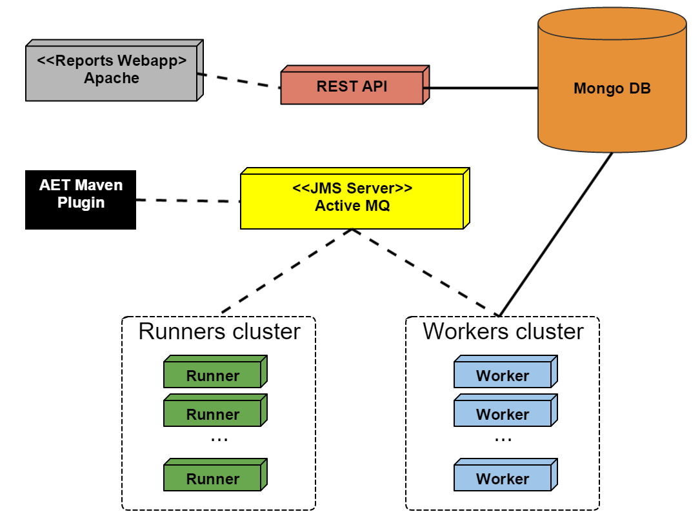

## System Components

The AET System consists of 7 core units:

* The Client (AET Maven Plugin)
* The Runner cluster
* The Worker cluster
* The JMS Server
* The Database
* The REST API
* Reports web application

### AET System architecture

#### Client

The Client component has the following functions

* sending request to the *AET System*.
* checking the suite processing status.
* downloading the Report after the *Test Suite* run is finished.

#### Test Executor

The Test Executor is an entry point of the test suite processing. It exposes endpoints which client applications can use to run the test suite and check the processing status by sending the simple HTTP requests.

#### Runner

The Runner is the heart of the system. It is responsible for consuming Client's request and dispatching it to Workers. It works similar to the Map-Reduce algorithm. During the execution of the suite, the Runner checks if the next phase can begin and when all the phases are finished the Runner informs the client about it.

#### Worker

The Worker is a single processing unit that can perform a specific task e.g. collect a screenshot using the *Firefox* browser in the *Windows 7* environment, collect a page source, compare two screenshots, check if the source of a page is W3C-complaint and many others.

#### JMS Server

The JMS Server is a communication hub for the whole system. Workers, runners and the client communicate with one another using JMS messages.

#### Database

The Database serves as the system storage. It stores all the results, reports and patterns.

#### REST API

The REST API for the stored data; the user can download the Report, collected sources, view screenshots and comparison results via the REST API.

### Third-party software used by system

AET uses the following third party software as parts of the system:

| Software | Used version | Function |
| -------- | ------------ | -------- |
|[Apache Karaf](http://karaf.apache.org/)|4.2.0|OSGi container for AET bundles and REST API.|
|[Apache ActiveMQ](http://activemq.apache.org/)|5.15.2|JMS Sever used for communication between system components.|
|[MongoDB](https://www.mongodb.org/)|3.2.3|System database.|
|[Browsermob](http://bmp.lightbody.net/)|2.1.4|Proxy server.|
|[Selenium Grid](https://www.seleniumhq.org/download/)|3.13.0+|Selenium Grid hub|
|[ChromeDriver](https://sites.google.com/a/chromium.org/chromedriver/downloads)|2.41+|Chrome web driver|
