- [Getting Started](#getting-started)
  - [What is AET](#what-is-aet)
  - [Why AET](#why-aet)
  - [AET In 10 Minutes](#aet-in-10-minutes)
    - [Prerequisites](#prerequisites)
    - [Vagrant setup](#vagrant-setup)
    - [Test setup](#test-setup)
    - [Run test](#run-test)
    - [Check results](#check-results)
    - [Build and upload application](#build-and-upload-application)
  - [Dictionary](#dictionary)
- [How To Use](#how-to-use)
  - [Environment Setup](#environment-setup)
    - [Basic Setup](#basic-setup)
    - [Advanced Setup](#advanced-setup)
  - [Defining Suite](#defining-suite)
    - [Test suite](#test-suite)
    - [Example test suite](#example-test-suite)
    - [suite](#suite)
    - [Suite Structure](#suite-structure)
  - [Running Suite](#running-suite)
    - [Requirements](#requirements)
    - [Running suite from command line](#running-suite-from-command-line)
    - [Tips and recommendations](#tips-and-recommendations)
    - [Tracking Progress](#tracking-progress)
  - [Features](#features)
    - [Open](#open)
    - [Collectors](#collectors)
    - [Modifiers](#modifiers)
    - [Comparators](#comparators)
    - [Data Filters](#data-filters)
    - [Parameters](#parameters)
  - [Suite Report](#suite-report)
    - [What is suite report?](#what-is-suite-report)
    - [Levels of report](#levels-of-report)
    - [Test cases](#test-cases)
    - [Features](#features-1)
- [How It Works](#how-it-works)
  - [System Components](#system-components)
    - [AET System architecture](#aet-system-architecture)
    - [Third-party software used by system](#third-party-software-used-by-system)
    - [Client Application](#client-application)
    - [Runner](#runner)
    - [Worker](#worker)
    - [REST API](#rest-api)
    - [Cleaner](#cleaner)
  - [Test Processing](#test-processing)
    - [Collection](#collection)
    - [Comparison](#comparison)
  - [Lock Mechanism](#lock-mechanism)
    - [Test suite run flow](#test-suite-run-flow)
  - [Database Structure](#database-structure)
    - [Overview](#overview)
    - [Metadata](#metadata)
    - [Artifacts](#artifacts)
  - [Logs](#logs)
    - [Overview](#overview-1)
    - [Log structue](#log-structue)
    - [Logs configuration](#logs-configuration)
    - [What's new](#whats-new)
  - [Migrate AET Suite to AET 2.0](#migrate-aet-suite-to-aet-20)
    - [Preparing the suite XML](#preparing-the-suite-xml)

<!-- END doctoc generated TOC please keep comment here to allow auto update -->


# Getting Started

## What is AET

AET (**A**utomated **E**xploratory **T**esting) is an online testing tool which aids front end client side layout regression testing of websites and portfolios. It allows team to ensure that a change in one part of the software did not introduce any defects in other parts of application. AET is a flexible application that can be adapted and tailored to the requirements of a given project.

## Why AET

The aim of AET is to assure better quality of the software. This goal is achieved by a couple of factors.

AET allows to easily and quickly create and maintain test as well as analyze their results. Because of that it encourages to cover wide part of software with tests. Test automation also has strong influence on test coverage, because AET is able to cover much bigger part of software than manual testing. Automation also helps to eliminate human errors as well as saves time. Finally, AET supports the continuous delivery of software.


## AET In 10 Minutes

This is a quick guide showing how to setup AET environment and run an example test.

### Prerequisites
Before start make sure that you have enough memory on your machine (8 GB is minimum, 16 GB recommended though).

You need to download and install following software:
* [VirtualBox 5.0](https://www.virtualbox.org/wiki/Downloads)
* [Vagrant 1.8.1](https://www.vagrantup.com/downloads.html)
* [ChefDK 0.11.0](https://downloads.chef.io/chef-dk/)
* [Maven](https://maven.apache.org/download.cgi) (at least version 3.0.4)

### Vagrant setup

Open command prompt as an administrator and execute the following commands:
* `vagrant plugin install vagrant-omnibus`
* `vagrant plugin install vagrant-berkshelf`
* `vagrant plugin install vagrant-hostmanager`

Navigate to the `vagrant` module directory. Run `berks install` and then `vagrant up` to start virtual machine. This process may take a few minutes.

### Test setup

Create file named `suite.xml` with following content:

```xml
<?xml version="1.0" encoding="UTF-8" ?>
<suite name="test-suite" company="company" project="project">
    <test name="first-test" useProxy="rest">
        <collect>
            <open/>
            <resolution width="800" height="600" />
            <sleep duration="1500"/>
            <screen/>
            <source/>
            <status-codes/>
            <js-errors/>
        </collect>
        <compare xmlns="http://www.cognifide.com/aet/compare/">
            <screen comparator="layout"/>
            <source comparator="w3c-html5"/>
            <status-codes filterRange="400,600"/>
            <js-errors>
                <js-errors-filter source="http://w.iplsc.com/external/jquery/jquery-1.8.3.js" line="2" />
            </js-errors>
        </compare>
        <urls>
            <url href="https://en.wikipedia.org/wiki/Main_Page"/>
        </urls>
    </test>
</suite>
```

Then create another file named `pom.xml` with following content:

```xml
<?xml version="1.0" encoding="UTF-8"?>
<project xmlns="http://maven.apache.org/POM/4.0.0"
        xmlns:xsi="http://www.w3.org/2001/XMLSchema-instance"
        xsi:schemaLocation="http://maven.apache.org/POM/4.0.0 http://maven.apache.org/xsd/maven-4.0.0.xsd">
    <modelVersion>4.0.0</modelVersion>

    <groupId>test-group</groupId>
    <artifactId>test-project</artifactId>
    <version>1.0.0</version>
    <packaging>pom</packaging>

    <name>Test project</name>
    <url>http://www.example.com</url>

    <properties>
        <aet.version>1.4.3</aet.version>
        <project.build.sourceEncoding>UTF-8</project.build.sourceEncoding>
    </properties>

    <build>
        <plugins>
            <plugin>
                <groupId>com.cognifide.aet</groupId>
                <artifactId>aet-maven-plugin</artifactId>
                <version>${aet.version}</version>
            </plugin>
        </plugins>
    </build>
</project>
```

It does not need to be in the same directory as `suite.xml` file.

### Run test

Once you have created both `suite.xml` and `pom.xml` files open command prompt in the directory which contains `pom.xml` file and execute following command:

```
mvn aet:run -DtestSuite=full/path/to/suite.xml
```

Remember to provide path to your `suite.xml` file.

### Check results

Once the test run finishes there should be `target` directory created inside a dicrectory containing the `pom.xml` file. Inside the `target` directory you should find `redirect.html` file. Open this file and the test report will show up in your web browser.

Congratulations! You have successfully created and run your first AET test.


### Build and upload application
You need JDK 8 and Maven 3.3.1 or newer to build AET application.
To build and upload application use following command from application root:
```
mvn clean install -P upload
```

#### Vagrant upload prequisities:
In order to be able to deploy bundles to Karaf instance define vagrant vm location in your setting.xml file (`$USER_HOME/m2`):
```
<server>
  <id>aet-vagrant-instance</id>
  <username>developer</username>
  <password>developer</password>
  <configuration>
    <sshExecutable>plink</sshExecutable>
    <scpExecutable>pscp</scpExecutable>
  </configuration>
</server>
```

## Dictionary

*Active MQ*  
a *JMS (Java Message Service)* Server which is a basic communication channel between AET System components.

*AET*  
an acronym for **A**utomatic **E**xploratory **T**esting, an online testing tool developed by Cognifide.

*AET Core*  
a set of system modules that are crucial to whole system work. The AET system will not work properly without all core modules configured and running properly.

*AET Jobs*  
implementations of jobs that can perform a particular task (e.g. collect screenshots, compare sources, validate a page against *W3C HTML5*).

*AET Maven Plugin*  
a default client application for the AET system that is used to trigger the execution of the *Test Suite*.

*Amazon Web Services*  
Cloud Computing Services where AET environment is setup.

*Apache Karaf*  
see *Karaf*.

*Artifact*  
usually used in the context of a small piece of data, the result of some operation (e.g. a collected screenshot or a list of *W3C HTML5* validation errors).

*AWS*  
see *Amazon Web Services*.

*Baseline*  
The act of taking a snap shot of the url/page and saving it to a file for future comparison in a number of ways to find differences.

*Browsermob*  
a proxy server used by AET to collect some kinds of data from tested pages.

*Cleaner*  
a module responsible for removing old and unused artefacts from the database.

*Collector*  
a module responsible for gathering data necessary for its further processing (e.g. validation, comparison).

*Collection*  
the first phase of the AET service during which all specified data is collected (e.g. screenshots, page source, js errors). Once they are collected successfully, all collection results are saved in the database.

*Comparator*  
a module responsible for comparing data currently collected to its existing pattern or validating it against a set of defined rules.

*Comparison*  
the second phase of the AET service that performs the operation on the data. collected during the first phase In some cases the collected data is compared to patterns, in others special validation is performed (e.g. *W3C HTML5*). The second phase starts before the collection finishes - just the moment when required artefacts are collected and become ready to be compared (e.g. to compare two screenshots system does not have to wait until the source of a page is collected).

*Cookie Collector*  
a collector responsible for collecting cookies.

*Cookie Comparator*  
a comparator responsible for processing collected cookies.

*Cookie Modifier*  
a modifier that allows to modify cookies for a given page, i.e. to add or remove cookies.

*Data Filter*  
a module responsible for filtering the collected data before performing comparison e.g. filtering uninteresting js errors before the js errors check takes place.

*Data Storage*  
a database abstraction layer which contains versioned data (data grid).

*Extract Element Modifier*  
a modifier that allows to extract an element from the html source (collected by the Screen Collector) by providing the id attribute or the class attribute.

*Feature*  
a part of the AET system which covers full testing case e.g. layout - this feature consists of the Screen Collector, the screen comparator and the layout reporter module.

*Firefox*  
a browser the AET tool makes use of, currently the version that is used is 30 en-US.

*Header Modifier*  
a modifier responsible for adding additional headers to a page.

*Hide Modifiers*  
a modifier responsible for hiding an element on a page that is unnecessary for a given test.

*Html-report*  
a basic report in a form of a HTML file.

*Java*  
a programming language that is used to develop the AET tool.

*Java Development Kit*  
see *JDK*.

*Java Management Extensions*  
see *JMX*.

*Java Message Service*  
see *JMS*.

*JavaScript*  
see *JS*.

*JDK*  
the *Java Development Kit* is a program development environment for developing Java applications.

*Jenkins*  
a continuous Integration (CI) server which is used as the user interface wrapper for the *AET Maven Plugin*.

*Jetty*  
a simple Http Server, used as a container for web applications.

*JMS*  
an acronym for the *Java Message Service*, simple message standard that allows application components to communicate with one another.

*JMX*  
*Java Management Extensions* (JMX) is a technology that is used to manage and monitor advanced interfaces of Java applications. In the AET tool it is used to manage *ActiveMQ*.

*JS*  
a dynamic programming language.

*JS Error*  
a JavaScript error that occurs in a script during its execution.

*JS Errors Collector*  
a collector responsible for collecting JavaScript errors occurring on a given page.

*JS Errors Comparator*  
a comparator responsible for processing the collected JavaScript error resource.

*JS Errors Filter*  
a filter that filters the results returned by the JS Errors Collector. It removes matched JavaScript errors from reports.

*JUnit*  
a simple framework allowing to develop repeatable tests. It is an instance of the xUnit architecture for unit testing frameworks. More information about it can be found at:  http://junit.org/.

*Karaf*  
in fact *Apache Karaf* is an OSGi container that provides a basic configuration for existing OSGi implementations (e.g. Apache Felix).

*Layout Comparator*  
a comparator responsible for comparing a collected screenshot of page to its pattern.

*Login Modifier*  
a modifier that allows to log in into the application and access secured sites.

*Maven*  
a software project management and comprehension tool. It used as a base for the *AET Maven Plugin*.

*Modifier*  
a module responsible for converting the target before the data collection process is performed e.g. modifying a requested header, adding a new cookie, hiding a visible element.

*MongoDB*  
an open-source cross-platform document-oriented database that the AET tool makes use of for data storage and management. MongoDB is developed by MongoDB Inc.

*Open*  
A module that is a special operand for the Collect Phase.

*OSGi*  
a modular system and services platform for Java. It is used as an application environment for AET Java components.

*Pattern*  
a sample model of data. Collection results are compared to their patterns to discover potential differences.

*pom.xml*  
a Maven tool configuration file that contains information about the project and configuration details used by Maven to build the project.

*Rebasing*  
am operation changing the existing pattern to the current result.

*Regression testing*  
This is a type of software testing that seeks to uncover new software bugs, or regressions, in existing functional and non-functional areas of a system. It is especially useful after changes such as enhancements, patches or configuration changes, have been made .

*Remove Lines Data Modifier*  
a modifier that allows to remove lines from the source (data or pattern) that a given page is compared to.

*Remove Nodes Data Modifier*  
a modifier that allows to delete some node(s) from a html tree. Node(s) are defined by the xpath selector.

*Report (Web application)*  
Web application for viewing / browsing AET tests results. (Only chrome browser is supported for now).

*Representational State Transfer API*  
see *Rest API*.

*Resolution Modifier*  
a modifier responsible for changing the size of the browser screen.

*Resource type*  
a unique name for the resource produced by the collector and consumed by the comparator.

*Rest API*  
a Representational State Transfer API for the data stored in the AET Database. It enables the user to browse the data and artifacts stored after a run of the *Test Suite* was completed.

*Runner*  
a unit responsible for the communication with the client and dispatching processing among workers.

*SCM repository*  
a data structure storing metadata for a set of files that is managed by a source control management (SCM) system responsible for managing changes in files. The most popular examples of SCM systems are Git (http://git-scm.com/) and SVN (https://subversion.apache.org/).

*Screen Collector*  
a collector responsible for collecting a screenshot of the page under a given URL.

*Selenium*  
a portable software testing framework for web applications.

*Selenium Driver*  
a test tool that allows to perform specific actions in a browser environment (e.g. take a screenshot of a page).

*Sleep Modifier*  
a modifier responsible for ceasing the execution of a given test temporarily. It causes a current thread to sleep.

*Source Collector*  
a collector responsible for collecting the source of a page under a given URL. Unlike other collectors the *Source Collector* does not use *Web Driver*. It connects directly to a web server.

*Source Comparator*  
a comparator responsible for comparing a collected page source with its pattern.

*Status Code*  
a response code for the resource request. For a detailed list of codes please refer to the Hypertext Transfer Protocol documentation at: http://www.w3.org/Protocols/rfc2616/rfc2616-sec10.html.

*Status Codes Collector*  
a collector responsible for collecting status codes for links to resources on a page under a given URL.

*Status Codes Comparator*  
a comparator responsible for processing collected *Status Codes*.

*Step*  
a single operation performed on url defined in `<collect>` phase of suite.

*Test*  
a definition of logical set of *Test Cases* performed on a set of URLs.

*Test Suite*  
a set of *Tests* (at least one) finished with the *Report*.

*Test Case*  
a single URL *Test* against a feature, e.g. a *W3C HTML* page test, a screenshot for the resolution 800x600 test.

*Thresholds*  
a feature allowing to declare a Jenkins build as ‘success’, ‘unstable’ or ‘failed’ depending on the number of *Tests* that failed or were skipped.

*Wait For Page Loaded Modifier*  
a modifier that waits until a page is loaded or a fixed amount of time is up.

*Web Console*  
the OSGi console installed on Apache Karaf. By default it is accessible via a browser: http://localhost:8181/system/console/configMgr. The default user/password are as follows: karaf/karaf.

*Worker*  
a single processing unit that can perform a defined amount of tasks (e.g. collect a screenshot, compare a source).

*W3C HTML5 Comparator*  
a comparator responsible for validating a collected page source against *W3C HTML5* standards.

*xunit-report*  
a *Report* that visualizes risks on the Jenkins job board and that contains information about the number of performed tests and the number of failures (potential threats).


# How To Use

## Environment Setup

There are two ways to setup AET environment: basic and advanced.

##### basic

Basic setup uses [Vagrant](https://www.vagrantup.com/) to create a single virtual machine running Linux OS (currently CentOS 6.7). This virtual machine contains all AET services as well as all required software. In this configuration, tests are using Linux version of Firefox web browser. Please note that there are differences in web pages rendering between Linux and Windows versions of Firefox and if you want to use Windows then you must use advanced setup.

See **[[Basic Setup|BasicSetup]]** for more details.

Diagram below shows basic AET setup.


##### advanced

Advanced setup on the other hand consists of two machines - one with Linux OS and one with Windows, both complementary to each other. Linux machine hosts services such as MongoDB, and ActiveMQ whereas Windows machine hosts Karaf, Browsermob proxy and Firefox. In this configuration, tests are using Windows version of Firefox web browser.

See **[[Linux and Windows Setup|LinuxAndWindowsSetup]]** for more details.

Diagram below shows advanced AET setup.


### Basic Setup

This setup uses vagrant module, a pseudo-cookbook which is responsible for local environment provisioning using Vagrant (powered by Chef + Berkshelf under the hood).

#### Overview

Currently a virtual machine with the following services is created:

* Karaf
* Apache
* Tomcat
* ActiveMQ
* MongoDb
* Brosermob
* Firefox
* X environment

#### AET services

All services are running using default ports. For communication please use IP address:

* `192.168.123.100`

#### General prerequisites

By default Vagrant virtual machine needs 3 GB of RAM and 2 vCPUs, so please make sure that you have enough memory on your machine (8 GB is minimum, 16 GB recommended though).

#### Installation

* Download and install
  [VirtualBox 5.0](https://www.virtualbox.org/wiki/Downloads)
* Download and install
  [Vagrant 1.8.1](https://www.vagrantup.com/downloads.html)
* Download and install [ChefDK 0.11.0](https://downloads.chef.io/chef-dk/)

As an administrator execute the following commands:

* `vagrant plugin install vagrant-omnibus`
* `vagrant plugin install vagrant-berkshelf`
* `vagrant plugin install vagrant-hostmanager`

Whenever you'd like to keep all Vagrant related data and virtual machine disks in non-standard directories please:

* set `VAGRANT_HOME` variable to new location (by default it is set to `$HOME/vagrant.d`).
* update VirtualBox settings (`File -> Preferences -> General`) to move all disks to other directory.

#### Starting virtual machine

Once you set all described things up just execute:

```
berks update && vagrant destroy -f && vagrant up
```

#### First run

All commands have to be executed when you're inside a directory that contains `Vagrantfile`.

Next please execute:

* `berks install` - downloads Chef dependencies from external sources. It acts as `mvn clean install`, but for Chef cookbooks.
* `vagrant up` - creates new virtual machine (`.box` file will be downloaded during first run), runs Chef inside it, sets domains and port forwarding up.

#### Updates

Whenever new version is released please execute the following:

* `git pull` to get latest version of `Vagrantfile`.
* `berks update` to update Chef dependencies.
* `vagrant provision` to re-run Chef on the virtual machine.

#### SSH access

To get into the virtual machine via SSH please execute `vagrant ssh` from the same directory that contains `Vagrantfile`. After that please type `sudo -i` and press ENTER to switch to `root`.

If you prefer to use PuTTY, mRemote or any other connection manager, please log in as user `vagrant` with password `vagrant` on `localhost` port `2222`. Keep in mind that the port may be different if you have more than one Vagrant machine running at the same time. You can check current assignment by executing `vagrant ssh-config` command from directory that contains your `Vagrantfile`.

#### Useful Vagrant commands

* `vagrant reload` restarts Vagrant machine and re-applies settings defined in
  `Vagrantfile`. It's useful whenever you've changed port forwarding or synced
  folder configuration.
* `vagrant destroy -f` deletes entire virtual machine.
* `vagrant reload --provision` restarts virtual machine and re-run Chef
  afterwards.
* `vagrant suspend` suspends currently running virtual machine.
* `vagrant resume` resumes suspended virtual machine.
* `vagrant status` show status of virtual machine described in `Vagrantfile`.
* `vagrant halt` halts/turns off virtual machine.

#### Port forwarding

Local port is a port exposed on your machine. You can access services via `localhost:<PORT>`.

VM port refers to port assigned inside Vagrant's virtual machine.

Port forwarding rules can be easily changed in `Vagrantfile`.

| Local port | VM port | Description |
| ---------- | ------- | ----------- |
| 8181       | 8181    | Karaf       |


#### Known Issues

* When getting following error on deploying application to local vagrant:
    ```
    What went wrong: Execution failed for task ':deployDevClearCache'. > java.net.ConnectException: Connection timed out: connect
    ```
    run `ifup eth1` command on vagrant using ssh.


### Advanced Setup

#### Operating Systems setup


This section describes advanced setup of AET using Linux and Windows. The main advantage of this approach is ability to run tests on Firefox on Windows, which is more reliable than Firefox on Linux.

Please note that full list of required tools and its versions can be found in [System Components](SystemComponents) section.

##### Linux Setup
1. Turn off Firewall. This may be achieved differently on various linux distribution, for example on CentOS `selinux` and `iptables` should be disabled.
2. Install MongoDB in version 2.6.4-1
3. Install JDK from Oracle (1.7)
4. Install ActiveMQ in version 5.9.0                                                                 
    * Enable JMX for ActiveMQ with connector under port `11199`
    * Switch Persistence for ActiveMQ
    * Enable cleaning unused topic for ActiveMQ
5. Install Apache Server
    * Configure site for the following path: `/opt/aet/apache/aet_reports/current`
    
##### Windows Setup
1. Install Java 7 JDK and update JAVA_HOME environment variable.
2. Change default console resolution - install VNC server (e.g. http://www.tightvnc.com/), connect by VNC client to console and change resolution (min. 1024x768).
3. Turn off Windows Firewall (both, private and public network location settings).
4. Install Karaf in version 2.3.9
    * Update Apache Felix Framework to version 4.2.1
    * Install Karaf as a Windows service
    * Check if it's working under http://localhost:8181/system/console/ and credentials karaf/karaf.
5. Install Browsermob in version 2.0.0
    * Install Browsermob as a Windows service
    * Check if it's working under http://localhost:9272/proxy.
6. Install Firefox 38.6.0 ESR
    * Turn off automatic updates
7. Check the following connections between Windows and Linux:
    * MongoDB: `telnet ${LINUX_MACHINE_PRIVATE_IP} 27017`
    * ActiveMQ: `telnet ${LINUX_MACHINE_PRIVATE_IP} 61616`
    * ActiveMQ's JMX: `jconsole.exe ${LINUX_MACHINE_PRIVATE_IP}:11199`

##### AET deployment
Here's a description where to deploy all the artifacts.

| Artifact     | Environment     | Default folder                      |
| ------------ | --------------- | ----------------------------------- |
| bundles.zip  | Windows - Karaf | /deploy                             |
| features.zip | Windows - Karaf | /deploy                             |
| configs.zip  | Windows - Karaf | /etc                                |
| report.zip   | Linux - Apache  | /opt/aet/apache/aet_reports/current |

#### OSGi Configuration

This section describes how to configure the AET OSGi services so that they could connect to the appropriate system components.

The services are configured through the Karaf Web Console which is hosted on Windows machine. Assuming that this machine's IP address is `192.168.0.2`, the Karaf console is available under following address: http://192.168.0.2:8181/system/console/configMgr.

##### Assumptions

The example configuration assumes the following:
* The IP address of Linux machine is `192.168.0.1`
* The IP address of Windows machine is `192.168.0.2`
* The Apache HTTP server serves Reports application under domain `http:\\aet-report`

##### Connections configuration

The diagram below shows which AET OSGi service should connect to which system component on the appropriate machine. On the diagram the arrows point from the AET services to the system components. The notes on the arrows contain the properties of each service which should be set and example values according to assumptions stated above.

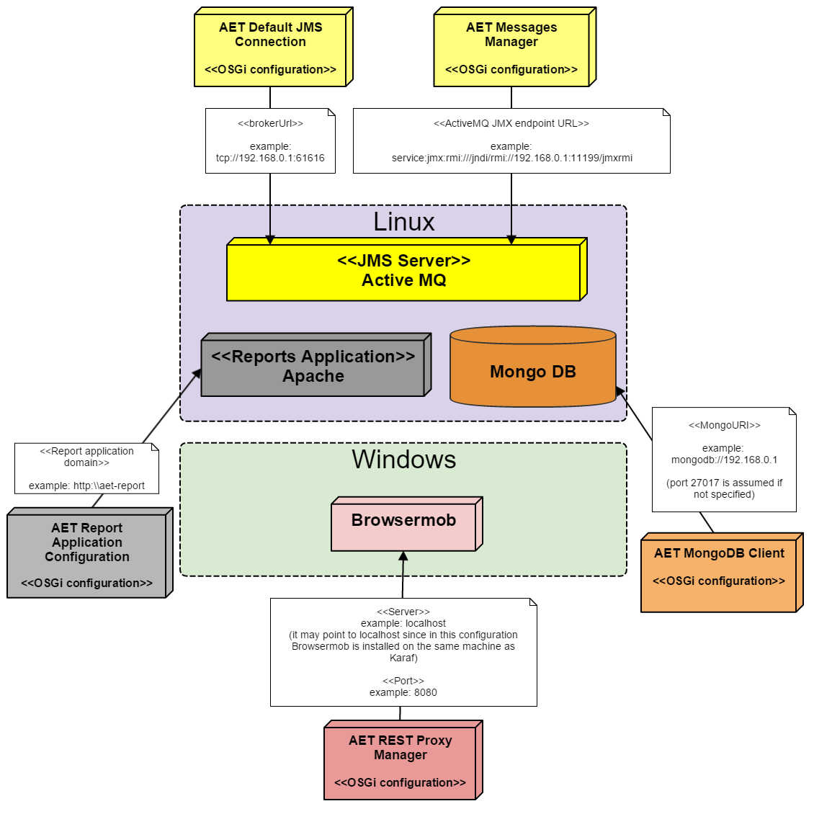

##### Collectors and comparators configuration

There are two more services that require configuration which are not present on the diagram above. The services are **AET Collector Message Listener** and **AET Comparator Message Listener**. There must be at least one of each of those services configured. Below there are listed the properties of each of above mentioned services with required values.

###### AET Collector Message Listener

| Property name | Value |
| ------------- | ----- |
| Collector name | Has to be unique within Collector Message Listeners. |
| Consumer queue name | Fixed value `AET.collectorJobs` |
| Producer queue name | Fixed value `AET.collectorResults` |
| Embedded Proxy Server Port | Has to be unique within Collector Message Listeners. |

###### AET Comparator Message Listener
| Property name | Value |
| ------------- | ----- |
| Comparator name | Has to be unique within Comparator Message Listeners. |
| Consumer queue name | Fixed value `AET.comparatorJobs` |
| Producer queue name | Fixed value `AET.comparatorResults` |


## Defining Suite

### Test suite

In general the test suite is an XML document that defines tests performed over collection of web pages. This chapter covers test suite API, with description of each element.

### Example test suite

```xml
<?xml version="1.0" encoding="UTF-8" ?>
<!-- Each test suite consists of one suite -->
<suite name="test-suite" company="cognifide" project="project">
    <!-- The First test of Test Suite -->
    <!-- The flow is [collect] [compare] [urls] -->
    <test name="first-test" useProxy="rest">
        <!-- Description of the collect phase -->
        <collect>
            <open/>
            <resolution width="800" height="600" />
            <!-- sleep 1500 ms before next steps - used on every url defined in urls -->
            <sleep duration="1500"/>
            <screen/>
            <source/>
            <status-codes/>
            <js-errors/>
        </collect>
        <!-- Description of compare phase, says what collected data should be compared to the patterns, can also define the exact comparator. If none chosen, the default one is taken. -->
        <compare xmlns="http://www.cognifide.com/aet/compare/">
            <screen comparator="layout"/>
            <source comparator="w3c-html5"/>
            <status-codes filterRange="400,600"/>
            <js-errors>
                <js-errors-filter source="http://w.iplsc.com/external/jquery/jquery-1.8.3.js" line="2" />
            </js-errors>
        </compare>
        <!-- List of urls which will be taken into tests -->
        <urls>
            <url href="http://www.cognifide.com"/>
        </urls>
    </test>
</suite>
```

Root element of test suite definition is `suite` element.

### suite

| ! Important |
|:----------- |
| When defining a suite a user should think of three mandatory parameters properly: `name, company, project`. Those parameters are used by the AET System to identify the suite. <br/><br/> Any change in one of those parameters values in the future will occur in treating the suite as a completely new one, which will in effect gather all the patterns from scratch. |

Root element for xml definition, each test suite definition consists of exactly one `suite` tag.

| Attribute name | Description |Mandatory  |
| -------------- | ----------- | --------- |
| `name` | Name of the test suite. Should consist only of lowercase letters, digits and/or characters: `-`, `_`. | yes |
| `company` | Name of the company. Should consist only of lowercase letters, digits and/or characters: `-`.| yes |
| `project` | Name of the project. Should consist only of lowercase letters, digits and/or characters: `-`.| yes |
| `domain` | General domain name consistent for all considered urls. Every url link is built as a concatenation of *domain* name and *href* attribute of it. If `domain` property is not set, then `href` value in `url` definition should contain full valid url. See more in [[Urls|Urls]] section. | no |

`suite` element contains one or more **[[test|SuiteStructure#test]]** elements.


### Suite Structure

#### test

This tag is definition of the single test in test suite. Test suite can contain many tests.

| Attribute name | Description | Mandatory |
| -------------- | ----------- | --------- |
| `name` | Name of the test. Should consists only of letters, digits and/or characters: `-`, `_`. This value is also presented on report (more details in [[Suite Report|SuiteReport]] section). | yes |
| `useProxy` | Defines which (if any) *Proxy* should be used during collection phase. If not provided, empty or set with `"false"`, proxy won't be used. If set to `"true"`, default *Proxy Manager* will be used. Otherwise *Proxy Manager* with provided name will be used (see [Proxy](#proxy)). Proxy is needed by Status Codes Collector and Header Modifier. | no |
| `zIndex` | Specifies order of tests on *HTML Report*. A test with greater `zIndex` is always before test with lower value. Default value is `0`. This attribute accepts integers in range `<-2147483648; 2147483647>`. | no |

Each **test** element contains:

* **one [collect](#collect) and one [compare](#compare) element** - test execution phases,
* **one [urls](#urls) element** - list of urls to process.

##### Proxy

Proxy is provided by two separated implementations: *embedded* and *rest*.

###### *embedded*

*Embedded* proxy does not need standalone *[[Browsermob Server|WindowsSetup#browsermob-proxy-setup]]*, but does not support SSL. *Embedded* proxy is used as default when `useProxy` is setted to "true" (which is equivalent to setting `useProxy="embedded"`*)*.

**Example usage**

```xml
<?xml version="1.0" encoding="UTF-8" ?>
<suite name="test-suite" company="cognifide" project="project">
    <test name="header-modify-test" useProxy="embedded">
      ...
    </test>
    ...
</suite>
```

###### rest

*Rest* proxy requires standalone *[[Browsermob Server|WindowsSetup#browsermob-proxy-setup]]*.

**Example usage**

```xml
<?xml version="1.0" encoding="UTF-8" ?>
<suite name="test-suite" company="cognifide" project="project">
    <test name="header-modify-test" useProxy="rest">
      ...
    </test>
    ...
</suite>
```

#### collect

This tag contain list of collectors and modifiers which will be run. It specifies what pages' data should be collected and it allows for some data modification before collection step. All collect steps are processed in defined order.

Each collector provides some specific result of gathering current data (i.e. png, html files) and a common metadata file - `result.json`.

Following elements are available in `collect` element:
* **[[Open|Open]]**
* **[[Collectors|Collectors]]**
* **[[Modifiers|Modifiers]]**

#### compare

This tag contain list of **[[Comparators]]**. Each comparator takes collected resource of defined type and runs it against comparator. It provides some specific result files illustrating found differences (i.e png, html files) and a common metadata file - `result.json`.

Each resource type has default comparator, user can use other comparators for each type by providing attribute `comparator` with comparator name, e.g.:
```xml
<source comparator="my_source_comparator"/>
```

runs `my_source_comparator` against each source collected during collection phase. Each comparator can contain list of **[[Data Filters|DataFilters]]** which will be performed before each compare phase.

Data filters are used to modify gathered data before these data are passed to comparator. For example you may remove some node from html tree. Data filters are defined in test suite xml as subnodes of `comparator` node.

Each Data Filter has predefined type of data on which it operates.

#### urls

See [[Urls]].


## Running Suite

Currently, running an AET suite requires using *aet-maven-plugin* which is an AET client application.

### Requirements
* Maven installed (recommended version - 3.0.4).
* Proper version of AET Maven plugin installed.
* Well-formed and valid xml test suite file available (described with details in [[Defining Suite|DefiningSuite]] chapter),
* `pom.xml` file with defined *aet-maven-plugin* configuration (described below).

#### pom.xml

This file (`pom.xml`) is a *Maven* tool configuration file that contains information about the project and configuration details used by *Maven* to build the project.

Running AET suite requires creating and configuring such a file. The File presented below might be used as a template for setup AET suite runs:

```xml
<?xml version="1.0" encoding="UTF-8"?>
<project xmlns="http://maven.apache.org/POM/4.0.0"
        xmlns:xsi="http://www.w3.org/2001/XMLSchema-instance"
        xsi:schemaLocation="http://maven.apache.org/POM/4.0.0 http://maven.apache.org/xsd/maven-4.0.0.xsd">
    <modelVersion>4.0.0</modelVersion>

    <groupId>{PROJECT-GROUP}</groupId>
    <artifactId>{PROJECT-NAME}</artifactId>
    <version>1.0.0</version>
    <packaging>pom</packaging>

    <name>Tests</name>
    <url>http://www.example.com</url>

    <properties>
        <aet.version>{PLUGIN-VERSION}</aet.version>
        <project.build.sourceEncoding>UTF-8</project.build.sourceEncoding>
    </properties>

    <build>
        <plugins>
            <plugin>
                <groupId>com.cognifide.aet</groupId>
                <artifactId>aet-maven-plugin</artifactId>
                <version>${aet.version}</version>
            </plugin>
        </plugins>
    </build>
</project>
```

User should configure three variables before proceeding to the next steps:
* `{PROJECT-GROUP}` which is a group the project belongs to. It should follow the package name rules, i.e. it is reversed domain name controlled by project owner and consists of lowercase letters and dots,
    * example: `com.example.test`
* `{PROJECT-NAME}` which is this build identifier for *Maven* tool. It should consist only of lowercase letters and `-` characters,
    * example: `aet-sanity-test`
* `{PLUGIN-VERSION}` which should be set to the *aet-maven-plugin* version currently used
    * example: `1.0.0`

Having the version as the maven property (`${aet.version}`) enables defining this parameter from the command line later, e.g. `-Daet.version=1.1.0`.

### Running suite from command line
Running the AET suite with *AET Maven plugin* from the command line can be done by invoking a maven command in the directory where the `pom.xml` file has been defined:
```
mvn aet:run -DtestSuite=FULL_PATH_TO_TEST_SUITE
```

The `testSuite` parameter is the path to the xml suite configuration file.

During test suite processing there will be information on its progress displayed in the console. It reflects how many artifacts were currently collected, compared and reported. When processing is finished the information about the processing status - `BUILD SUCCESS` or `BUILD FAILURE` - is displayed in the console.

When the test run completes, the resulting report files can be found in the maven run `target` folder.

Check [[Client Application|ClientApplication]] for more details about `aet-maven-plugin`.

### Tips and recommendations

Generally it is a good idea to create a separate **SCM repository** (e.g. *GIT* or *SVN*) for AET suites. This will enable running AET suites using Jenkins easily.


### Tracking Progress

#### How to read AET Reports and real time progress

AET test reports are updated on real time basis and can be viewed on the console. This progress information is accessible in using two methods:

as a command line and with use of Jenkins job. To see progress

* log on Jenkins
* choose proper build execution from Build history panel and
* click Console Output.

For every test suite started the execution information is provided in the progress log:
```
[INFO] ********************************************************************************
[INFO] ********************** Job Setup finished at 10:14:43.249.**********************
[INFO] *** Suite is now processed by the system, progress will be available below. ****
[INFO] ********************************************************************************
```

During test processing detailed information about actual progress is displayed as in the following example:

```
...
[INFO] [06:34:20.680]: COLLECTED: [success: 0, total: 72] ::: COMPARED: [success: 0, total: 0]
[INFO] [06:34:31.686]: COLLECTED: [success: 1, total: 72] ::: COMPARED: [success: 1, total: 1]
[INFO] [06:34:35.689]: COLLECTED: [success: 2, total: 72] ::: COMPARED: [success: 1, total: 2]
[INFO] [06:34:36.691]: COLLECTED: [success: 2, total: 72] ::: COMPARED: [success: 2, total: 2]
[INFO] [06:34:43.695]: COLLECTED: [success: 3, total: 72] ::: COMPARED: [success: 2, total: 3]
[INFO] [06:34:44.698]: COLLECTED: [success: 3, total: 72] ::: COMPARED: [success: 3, total: 3]
...
```

where:

**collected** - shows results of collectors' work - how many artifacts have been successfully collected and what is the total number of all artifacts to be collected,

**compared** -  shows results of comparators' work - how many artifacts have been successfully compared and what is the total number of all artifacts to be compared. The total number of artifacts to be compared depends on collectors' work progress - increases when the number of successfully collected artifacts increase.

If there are problems during processing, warning information with some description of processing step and its parameters is displayed:
```
[WARN] CollectionStep: source named source with parameters: {} thrown exception. TestName: comparator-Source-Long-Response-FAILED UrlName: comparators/source/failed_long_response.jsp Url: http://192.168.123.100:9090/sample-site/sanity/comparators/source/failed_long_response.jsp
```

In this example source collector failed to collect necessary artifacts. This information is subsequently reflected in the progress log:
```
...
[INFO] [06:36:44.832]: COLLECTED: [success: 46, failed: 1, total: 72] ::: COMPARED: [success: 46, total: 46]
[INFO] [06:36:50.837]: COLLECTED: [success: 47, failed: 1, total: 72] ::: COMPARED: [success: 47, total: 47]
[INFO] [06:36:52.840]: COLLECTED: [success: 48, failed: 1, total: 72] ::: COMPARED: [success: 47, total: 48]
...
```

In the example above one artifact has failed during collection phase.

#### When tests successfully finish - command line

When the AET test processing completes the information about received reports and processing status - BUILD SUCCESS or BUILD FAILURE is shown on the console - as shown below:

```
[INFO] Received report message: ReportMessage{company=aet-demo-sanity, project=demo-sanity-test, testSuiteName=main, status=OK, environment=win7-ff16, domain=http://192.168.123.100:9090/sample-site/sanity/, correlationId=aet-demo-sanity-demo-sanity-test-main-1426570459612}
[INFO] [06:38:03.549]: COLLECTED: [success: 71, failed: 1, total: 72] ::: COMPARED: [success: 71, total: 71]
[INFO] Received report message: ReportMessage{company=aet-demo-sanity, project=demo-sanity-test, testSuiteName=main, status=OK, environment=win7-ff16, domain=http://192.168.123.100:9090/sample-site/sanity/, correlationId=aet-demo-sanity-demo-sanity-test-main-1426570459612}
[INFO] Total: 2 of 2 reports received.
[INFO] ------------------------------------------------------------------------
[INFO] BUILD SUCCESS
[INFO] ------------------------------------------------------------------------
[INFO] Total time: 3:45.645s
[INFO] Finished at: Tue Mar 17 06:38:03 CET 2015
[INFO] Final Memory: 14M/246M
[INFO] ------------------------------------------------------------------------
```

BUILD SUCCESS  - status means that test processing is successfully finished and reports are generated in target folder.

BUILD FAILURE  - status means that there were some technical problem during processing for example database is not responding and it is not possible to receive reports.

#### When test is successfully finished - Jenkins job

Jenkins console output presents the same information as described above, but if test suite is defined to generate xunit-report additional information such as Junit processing is logged on console:

```
[xUnit] [INFO] - Starting to record.
[xUnit] [INFO] - Processing JUnit
[xUnit] [INFO] - [JUnit] - 1 test report file(s) were found with the pattern 'test-suite/target/xunit-report.xml' relative to '/var/lib/jenkins/jobs/aet-sanity-test-integration/workspace' for the testing framework 'JUnit'.
[xUnit] [INFO] - Converting '/var/lib/jenkins/jobs/aet-sanity-test-integration/workspace/test-suite/target/xunit-report.xml' .
[xUnit] [INFO] - Check 'Failed Tests' threshold.
[xUnit] [INFO] - The new number of tests for this category exceeds the specified 'new unstable' threshold value.
[xUnit] [INFO] - Setting the build status to UNSTABLE
[xUnit] [INFO] - Stopping recording.
Build step 'Publish xUnit test result report' changed build result to UNSTABLE
Finished: UNSTABLE
```

The meaning of '*Successful*' and '*Failed*' build is quite different here, because final build status depends mainly on tests results and thresholds configuration. The build can result with BUILD SUCCESS status (which means that all workers - collectors, comparators, reporters finish their work and proper reports were generated), but final Jenkins build status can be for example UNSTABLE becase there were some new test failures.

A Jenkins build is considered as UNSTABLE (yellow) or FAILURE (red) if the new (tests that failed now, but did not fail in previous run) or total number of failed tests exceeds the specified thresholds. For example:when "yellow total" threshold is set to 0 and one or more test cases failed, then build is mark as UNSTABLE.


## Features

AET tests can use a number of useful features which check different elements of the page. You can find more information about them in subpages of this page.

Below you can find a few common cases which demonstrate how to use those features.

##### Compare layout without dynamic content

This is the case where you want to test layout of some page by making a screenshot of page in specified resolution. Your page has some dynamic content e.g. carousel or advertisement and you don't want it to influence the results of your test. The following code snippet shows the test suite for such case:

```xml
<?xml version="1.0" encoding="UTF-8" ?>
<suite name="test-suite" company="company" project="project">
    <test name="first-test" useProxy="rest">
        <collect>
            <open/>
            <hide xpath="//div[@id='mw-panel']" />
            <resolution width="800" height="600" />
            <sleep duration="1500"/>
            <screen/>
        </collect>
        <compare>
            <screen comparator="layout"/>
        </compare>
        <urls>
            <url href="https://en.wikipedia.org/wiki/Main_Page"/>
        </urls>
    </test>
</suite>
```

This test checks the layout of Wikipedia's main page. After opening page the [[Hide Modifier|HideModifier]] is used to hide the navigation bar on the left side of page. Then the [[Resolution Modifier|ResolutionModifier]] is used to set the screenshot resolution to `800x600` and [[Screen Collector|ScreenCollector]] makes a screenshot. Finally [[Layout Comparator|LayoutComparator]] compares page layout with previous test run.

##### Collect status codes from desired range

This is the case when you want to check the status codes of requests generated by page and you are only interested in specific range of codes, e.g. client errors (codes 400-499). The following code snippet shows the test suite for such case:

```xml
<?xml version="1.0" encoding="UTF-8" ?>
<suite name="test-suite" company="company" project="project">
    <test name="first-test" useProxy="rest">
        <collect>
            <open/>
            <status-codes />
        </collect>
        <compare>
            <status-codes filterRange="400,499" />
        </compare>
        <urls>
            <url href="https://en.wikipedia.org/wiki/Main_Pagee"/>
        </urls>
    </test>
</suite>
```

This test uses [[Status Codes Collector|StatusCodesCollector]] to gather status codes for given url (which in this case points to non-existent resource). Then the [[Status Codes Comparator|StatusCodesComparator]] is used to display status codes that fit within range from `400` to `499`.

##### Add cookie to remove cookie consent dialog

This is the case when you want to dismiss a dialog asking for a consent for storing cookies which has to be displayed if the page needs to be compliant with EU legislation. Some pages use cookies to determine if the dialog should be displayed. The following code snippet shows the test suite for such case:

```xml
<suite name="test-suite" company="company" project="project">
    <test name="first-test" useProxy="rest">
        <collect>
            <modify-cookie action="add" cookie-name="eu_cn" cookie-value="1" />
            <open/>
            <sleep duration="1500"/>
            <screen/>
        </collect>
        <compare>
            <screen comparator="layout"/>
        </compare>
        <urls>
            <url href="http://example.com/"/>
        </urls>
    </test>
</suite>
```

This test uses [[Cookie Modifier|CookieModifier]] to add a cookie named `eu_cn` with value `1` which in this example tells that the user already gave consent to store cookies. After that the screenshots is collected and the layout of page is compared with previous test.

##### Collect JavaScript errors and ignore specific ones

This is the case when you want to check if there are any JavaScript errors on the page. You know that, for example, some third party library used has an error but you don't want it to affect your test. The following code snippet shows the test suite for such case:

```xml
<suite name="test-suite" company="company" project="project">
    <test name="first-test" useProxy="rest">
        <collect>
            <open/>
            <js-errors/>
        </collect>
        <compare>
            <js-errors>
                <js-errors-filter error="Uncaught ReferenceError: variable is not defined"/>
            </js-errors>
        </compare>
        <urls>
            <url href="http://example.com/"/>
        </urls>
    </test>
</suite>
```

This test uses [[JS Errors Collector|JSErrorsCollector]] to collect JavaScript errors. Then the [[JS Errors Comparator|JSErrorsComparator]] is used do display the issues. Within comparator the [[JS Errors Data Filter|JSErrorsDataFilter]] ignoring specified error is defined.

##### Compare source ignoring embedded scripts

This is the case, when you want to check source of the page but you want to exclude some code from comparison. It could be, for instance, an embedded analytics script. The following code snippet shows the test suite for such case:

```xml
<suite name="test-suite" company="company" project="project">
    <test name="first-test" useProxy="rest">
        <collect>
            <source />
        </collect>
        <compare>
            <source comparator="source" compareType="allFormatted">
                <remove-nodes xpath="//script" />
            </source>
        </compare>
        <urls>
            <url href="https://en.wikipedia.org/wiki/Main_Page"/>
        </urls>
    </test>
</suite>
```

This test uses [[Source Collector|SourceCollector]] to gather source code. Then [[Source Comparator|SourceComparator]] compares source of the page with previous test. The applied [[Remove Nodes Data Filter|RemoveNodesDataFilter]] removes all `<script>` nodes from source before comparison takes place.


### Open

Open module is special operand for collect phase. It is responsible for opening web page for given url and preparing browser environment to perform chain of collections and modifications.

Second usage of this module is to allow user easily perform actions before page is being opened, such as modify headers, cookies etc.

| ! Open module |
|:------------- |
| Each collect phase **must** contain open module. |

| ! Note |
|:------ |
| In some cases it is recommended to use **[[Sleep Modifier|SleepModifier]]** or **[[Wait For Page Loaded Modifier|WaitForPageLoadedModifier]]** after open module. |

Module name: **open**

#### Parameters

No parameters

#### Example Usage

```xml
<?xml version="1.0" encoding="UTF-8" ?>
<suite name="test-suite" company="cognifide" project="project">
    <test name="open-test">
      <collect>
        ...
        <!-- example action before page is opened -->
        <open/>
        <!-- collect page data -->
        ...
      </collect>
      <compare>
        ...
      </compare>
      <urls>
        ...
      </urls>
    </test>
    ...
    <reports>
      ...
    </reports>
</suite>
```


### Collectors

Collector is module which main task is to collect data from tested pages.

Each collector presented in section below consist of two elements:

* module name (produced resource type),
* parameters.

##### Module name (produced resource type)

This name is unique identifier of system functionality. Each collector has its unique name, this name should be also unique for all modules in *[[collect|SuiteStructure#collect]]* phase. This is always name of tag definition for collector.

AET System does not know what work will be performed by collector when it reads suite definition. The only thing that is known is **module name**. System will recognize which collector should be called by matching definition from *[[collect|SuiteStructure#collect]]* phase with name registered in system. When no collector in system with defined name is found, system exception will occur and test will be not performed. This solution enables adding new features to the system without system downtime (just by installing new feature bundle).

Each collector produces resource of defined type. This type can be later recognized by [[comparators |Comparators]] and [[data filters|DataFilters]]. Two collectors can't produce data with the same resource type. **Produced resource type is always equal to collector module name.**

##### Parameters

This is set of key-value pairs using which user can pass some configuration and information to collector. Parameters for collectors are usually not mandatory - passing this parameter is not obligatory, usually this is some collector functionality extension. However, there is one special property: **name**. Collector with set name can be treated in special way by [[comparators|Comparators]] (some comparators may look only for collection results from specifically named collectors), example:

```xml
...
<collect>
  <open/>
  <sleep duration="1000"/>
  <screen width="1280" height="1024" name="desktop"/>
  <screen width="768" height="1024" name="tablet"/>
  <screen width="320" height="480" name="mobile"/>
</collect>
<compare>
  <screen collectorName="mobile"/>
</compare>
...
```

During collect phase, three screenshot with different resolutions will be taken and saved to database. However, only one of them (*mobile*) will be compared with pattern during comparison phase and presented on report (under "*Layout For Mobile*" section).

##### Definitions illustration

Following picture presents elements described earlier:


where:

1. Module name (produced resource type),
2. Parameters,
3. Special collector property: name,
4. Special comparator property: collectorName.


#### Accessibility Collector BETA

| ! Beta Version |
|:------------   |
| This AET Plugin is currently in BETA version. |

Accessibility Collector is responsible for collecting validation result containing violations of a defined coding standard found on a page. It uses [HTML_CodeSniffer](http://squizlabs.github.io/HTML_CodeSniffer/) tool to find violations.

Module name: **accessibility**

##### Parameters

| Parameter | Value | Description | Mandatory |
| --------- | ----- | ----------- | --------- |
| `standard` |WCAG2A<br/> WCAG2AA (default)<br/> WCAG2AAA | Parameter specifies a standard against which the page is validated. More information on standards: [WCAG2](http://squizlabs.github.io/HTML_CodeSniffer/Standards/WCAG2/) | no |

##### Example Usage

```xml
<?xml version="1.0" encoding="UTF-8" ?>
<suite name="test-suite" company="cognifide" project="project">
    <test name="source-test">
        <collect>
            ...
            <accessibility standard="WCAG2AAA" />
            ...
        </collect>
        <compare>
            ...
        </compare>
        <urls>
            ...
        </urls>
    </test>
    ...
    <reports>
        ...
    </reports>
</suite>
```


#### Client Side Performance Collector BETA

| ! Beta Version |
|:------------   |
| This AET Plugin is currently in BETA version. |

Client Side Performance Collector is responsible for collecting performance analysis result. It uses [YSlow](http://yslow.org/) tool to perform analysis.

Module name: **client-side-performance**

| ! Important information |
|:----------------------- |
| In order to use this collector **proxy** must be used. |

##### Parameters
No parameters.

##### Example Usage

```xml
<?xml version="1.0" encoding="UTF-8" ?>
<suite name="test-suite" company="cognifide" project="project" environment="win7-ff16">
    <test name="source-test" useProxy="rest">
        <collect>
            ...
            <client-side-performance />
            ...
        </collect>
        <compare>
            ...
        </compare>
        <urls>
            ...
        </urls>
    </test>
    ...
    <reports>
        ...
    </reports>
</suite>
```


#### Cookie Collector

Cookie collector is responsible for collecting cookies.

Module name: **cookie**

##### Parameters

No parameters.

##### Example Usage

```xml
<?xml version="1.0" encoding="UTF-8" ?>
<suite name="test-suite" company="cognifide" project="project">
    <test name="cookie-test">
        <collect>
            ...
            <cookie/>
            ...
        </collect>
        <compare>
            ...
        </compare>
        <urls>
            ...
        </urls>
    </test>
    ...
    <reports>
        ...
    </reports>
</suite>
```


#### JS Errors Collector

JS Errors Collector is responsible for collecting javascript errors occuring on given page.

Module name: **js-errors**

##### Parameters

No parameters.

##### Example Usage

```xml
<?xml version="1.0" encoding="UTF-8" ?>
<suite name="test-suite" company="cognifide" project="project">
    <test name="js-errors-test">
        <collect>
            ...
            <js-errors/>
            ...
        </collect>
        <compare>
            ...
        </compare>
        <urls>
            ...
        </urls>
    </test>
    ...
    <reports>
        ...
    </reports>
</suite>
```


#### Screen Collector

| ! Compare collected screenshot |
|:------------------------------ |
| Please remember that defining collector and not using it during comparison phase is configuration error. From now on suites that define screen collection and does not use it during comparison phase will be rejected during suite validation phase. |

| ! Notice    |
| :---------- |
| Since AET 1.4.0 version AET Screen Collector will have no parameters. Please use [[Resolution Modifier|ResolutionModifier]] in order to perform browser resolution change. Using Screen collector without resolution change will not guarantee any specific screenshot resolution. |

Screen Collector is responsible for collecting screenshot of the page under given URL.

Module name: **screen**

**Note that you cannot maximize the window and specify the dimension at the same time. If no parameters provided, default browser size is set before taking screenshot.**

##### Example Usage

```xml
<?xml version="1.0" encoding="UTF-8" ?>
<suite name="test-suite" company="cognifide" project="project">
    <test name="screen-test">
        <collect>
            ...
            <screen name="desktop" />
            ...
        </collect>
        <compare>
            ...
        </compare>
        <urls>
            ...
        </urls>
    </test>
    ...
    <reports>
        ...
    </reports>
</suite>
```

 Instead of

```xml
<screen width="1280" height="1024" name="desktop" />
```

please use:

```xml
<resolution width="1280" height="1024"/>
<sleep duration="1000" />
<screen name="desktop" />
```

| ! Note |
|:------ |
| Before taking screenshot [[Hide modifier|HideModifier]] can be applied in order to hide from the screen some elements that are not necessary for comparison, i.e. Twitter feed. <br/><br/> Also [[Resolution Modifier|ResolutionModifier]] and [[Wait For Page Loaded Modifier|WaitForPageLoadedModifier]] can be applied before Screen Collector usage to change expected collect result. <br/><br/> As in example presented above, `name` parameter can be very useful when using screen collector. More information about this parameter can be found in [[Collectors|Collectors]] section. |


#### Source Collector

Source Collector is responsible for collecting source of the page under given URL. Unlike others collectors source collector doesn't use web driver, it connects directly to web server.

Module name: **source**

| ! Note    |
| :-------- |
| System is waiting up to 20 seconds before request is timed out. This parameter is not configurable. |

##### Parameters

No parameters.

##### Example Usage

```xml
<?xml version="1.0" encoding="UTF-8" ?>
<suite name="test-suite" company="cognifide" project="project">
    <test name="source-test">
        <collect>
            ...
            <source />
            ...
        </collect>
        <compare>
            ...
        </compare>
        <urls>
            ...
        </urls>
    </test>
    ...
    <reports>
        ...
    </reports>
</suite>
```


#### Status Codes Collector

Status Codes Collector is responsible for collecting status codes of links to resources on the page under given URL.

Module name: **status-codes**

| ! Important information |
| :---------------------- |
| In order to use this collector *[[proxy|SuiteStructure#proxy]]* must be used. |

##### Parameters

No parameters.

##### Example Usage

```xml
<?xml version="1.0" encoding="UTF-8" ?>
<suite name="test-suite" company="cognifide" project="project">
    <test name="status-codes-test">
        <collect>
            ...
            <status-codes />
            ...
        </collect>
        <compare>
            ...
        </compare>
        <urls>
            ...
        </urls>
    </test>
    ...
    <reports>
        ...
    </reports>
</suite>
```


### Modifiers

Modifier is module which performs particular modification on data before collection happens.

Each modifier consists of two elements:
* module name,
* parameters.

##### Module name
This name is unique identifier for each modifier (and each module in collect phase).

##### Parameters
This is set of key-value pairs using which user can pass some configuration and information to modifier. Parameters for modifiers can be divided into two groups:
* mandatory - parameters without which modification will not be possible,
* optional - passing this parameter is not obligatory, usually they trigger some functionality extensions.


#### Click Modifier

Click Modifier allows to perform click action on some element on page. When element is not found (e.g. by improper xpath value) warning will be logged but test will be passed to the next steps.

Module name: **click**

| ! Important information |
|:----------------------- |
| In order to use this modifier it must be declared after open module in test suite XML definition.<br/><br/> Remember that element that will be clicked **must be visible** in the moment of performing click action. |

##### Parameters
| Parameter | Default value | Description | Mandatory |
| --------- | ------------- | ----------- | --------- |
| `xpath` | | xpath of element to click | yes |
| `timeout` | | Timeout for element to appear, in milliseconds. Max value of this parameter is 15000 milliseconds (15 seconds). | yes |

##### Example Usage

```xml
<?xml version="1.0" encoding="UTF-8" ?>
<suite name="test-suite" company="cognifide" project="project">
    <test name="click-test">
        <collect>
            <open />
            ...
            <click xpath="//*[@id='header_0_container1_0_pRow']/div[1]/div/div/a/img" timeout="3000" />
            <sleep duration="2000" />
            ...
            <resolution width="1280" height="800" />
            <screen name="desktop" />
            ...
        </collect>
        <compare>
            ...
            <screen comparator="layout" />
            ...
        </compare>
        <urls>
        ...
        </urls>
    </test>
    ...
    <reports>
        ...
    </reports>
</suite>
```


#### Cookie Modifier

Cookie Modifier allows to modify cookies for given page, i.e. add or remove some cookies.

Module name: **modify-cookie**

| ! Important information |
|:----------------------- |
| In order to use this modifier it must be declared before open module in test suite XML definition. When declared after open module (but before Cookie Collector) it can be used as filter for Cookie Collector. |

##### Parameters

| Parameter | Value | Description | Mandatory |
| --------- | ----- | ----------- | --------- |
| `action`  | add <br/> remove | Specifies what action should be taken with given cookie | yes |
| `cookie-name` | | Cookie name | yes |
| `cookie-value` | | Cookie value | Yes, if `add action` is chosen |
| `cookie-domain` | | Cookie domain attribute value | No, used only if `add action` is chosen |
| `cookie-path` | | Cookie path attribute value | No, used only if `add action` is chosen |

| ! Note |
|:------ |
| If `cookie-domain` provided WebDriver will reject cookies unless the Domain attribute specifies a scope for the cookie that would include the origin server. For example, the user agent will accept a cookie with a Domain attribute of `example.com` or of `foo.example.com` from `foo.example.com`, but the user agent will not accept a cookie with a Domain attribute of `bar.example.com` or of `baz.foo.example.com`. For more information read [here](https://tools.ietf.org/html/rfc6265#section-4.1.2.3). |

| ! Note |
|:------ |
| If `cookie-path` provided WebDriver will reject cookie unless the path portion of the url matches (or is a subdirectory of) the cookie's Path attribute, where the `%x2F` (`/`) character is interpreted as a directory separator. |

##### Example Usage

```xml
<?xml version="1.0" encoding="UTF-8" ?>
<suite name="test-suite" company="cognifide" project="project">
    <test name="cookie-modify-test">
        <collect>
            ...
            <modify-cookie action="add" cookie-name="sample-cookie" cookie-value="sample-cookie-value"/>
            <modify-cookie action="remove" cookie-name="another-cookie"/>
            ...
            <open />
            ...
        </collect>
        <compare>
            ...
        </compare>
        <urls>
        ...
        </urls>
    </test>
    ...
    <reports>
        ...
    </reports>
</suite>
```


#### Header Modifier

Header Modifier is responsible for injecting additional headers to page before it is opened to test.

Module name: **header**

| ! Important information |
|:----------------------- |
| In order to use this modifier it must be declared before open module in test suite XML definition and *[[proxy|SuiteStructure#proxy]]* must be used. |

##### Parameters

| Parameter | Value | Description | Mandatory |
| --------- | ----- | ----------- | --------- |
| `key` | x | Key for header | yes |
| `value` | y | Value for header | yes |

##### Example Usage

```xml
<?xml version="1.0" encoding="UTF-8" ?>
<suite name="test-suite" company="cognifide" project="project">
    <test name="header-modify-test">
        <collect>
            ...
            <header key="Authorization" value="Basic emVuT2FyZXVuOnozbkdAckQZbiE=" />
            ...
            <open />
            ...
        </collect>
        <compare>
            ...
        </compare>
        <urls>
        ...
        </urls>
    </test>
    ...
    <reports>
        ...
    </reports>
</suite>
```


#### Hide Modifier

Hide Modifier is responsible for hiding some unnecessary for test element on page. Affects [[Screen Collector|ScreenCollector]] results. Hiding is done by setting css `visibility` property to `hidden`. Works with webDriver only. You can hide many elements by defining many `<hide>` nodes. If xpath covers more than one element then all elements that match defined xpath will be hidden.

Module name: **hide**

| ! Important information |
|:----------------------- |
| In order to use this modifier it must be declared after open module in test suite XML definition. |

##### Parameters

| Parameter | Value | Description | Mandatory |
| --------- | ----- | ----------- | --------- |
| `xpath` | xpath_to_element | Xpath to element(s) to hide | yes |
| `leaveBlankSpace` | boolean | Defines if element(s) should be invisible (effect as using `display=none`) or should be not displayed (effect as using `visibility=hidden`). When set to `true`, blank and transparent space is left in place of the hidden element, otherwise, element is completely removed from the view. When not defined, hide modifier behaves as if `leaveBlankSpace` property was set to `true`. | no |

##### Example Usage

```xml
<?xml version="1.0" encoding="UTF-8" ?>
<suite name="test-suite" company="cognifide" project="project">
    <test name="hide-test">
        <collect>
            <open />          
            ...
            <hide xpath="//*[@id='logo']" />
            <hide xpath="//*[@id='primaryNavMenu']/li[2]/a/div" />            
            ...
            <resolution width="1280" height="800" />
            <screen name="desktop" />
            ...
        </collect>
        <compare>
            ...
        </compare>
        <urls>
        ...
        </urls>
    </test>
    ...
    <reports>
        ...
    </reports>
</suite>
```


#### Login Modifier

| ! Note |
|:------ |
| This module is no longer supported and may not work correctly. It may be removed in future version. |

Login Modifier allows to login into pages that have access secured with login form. If input element wont be available (wont be loaded yet) then Login Modifier will wait up to 10s for login input, then for password input and at the end for submit button to appear. If any element won't be ready then TimeoutException will be thrown.

Module name: **login**

| ! Important information |
|:----------------------- |
| In order to use this modifier it must be declared before open module in test suite XML definition. |

##### Parameters

| Parameter | Value | Mandatory | Default value |
| --------- | ----- | --------- | ------------- |
| `login` | User's login | no | admin |
| `password` | Password | no | admin |
| `login-page` | Url to login page | no | [http://localhost:4502/libs/granite/core/content/login.html](http://localhost:4502/libs/granite/core/content/login.html) |
| `login-input-selector` | Xpath expression for login input | no | //input[@name='j_username'] |
| `password-input-selector` | Xpath expression for password input | no | //input[@name='j_password'] |
| `submit-button-selector` | Xpath expression for submit button | no | //*[@type='submit'] |
| `login-token-key` | Name for cookie we get after successfull login | no | login-token |
| `timeout` | Number of milliseconds (between 0 and 10000) that modifier will wait to login page response after submiting credentials. | no | 0 |
| `force-login` | Enforces login even when login cookie is present. | no | false |

##### Example Usage

```xml
<?xml version="1.0" encoding="UTF-8" ?>
<suite name="test-suite" company="cognifide" project="project">
    <test name="login-test">
        <collect>
            <login login="user"
                password="password"
                login-page="http://192.168.180.19:5503/libs/cq/core/content/login.html"
                login-input-selector="//input[@name='j_username']"
                password-input-selector="//input[@name='j_password']"
                submit-button-selector="//*[@type='submit']" />
            <open />
            ...
        </collect>
        <compare>
            ...
        </compare>
        <urls>
        ...
        </urls>
    </test>
    ...
    <reports>
        ...
    </reports>
</suite>
```


#### Resolution Modifier

Resolution Modifier is responsible for changing browser screen size. Affects [[Screen Collector | ScreenCollector]] results.  

| ! Note |
|:------ |
| Please note that final resoulution of screenshots may be different when scrollbar is dispayed. <br/><br/> Default  width of Firefox's Scrollbar is equal to 33px.  (so when you want to grab viewport of size 1024, then set width parameter to 1057px) |

Module name: **resolution**

##### Parameters

| Parameter | Value | Description | Mandatory |
| --------- | ----- | ----------- | --------- |
| ~~`maximize`~~ | ~~true <br/> false (default)~~ | ~~Maximize browser window~~ | This property is deprecated and will be removed in future release. |
| `width` | int (1 to 100000) | Window width | no |
| `height` | int (1 to 100000) | Window height | no |

| ! Important information |
|:----------------------- |
| You cannot maximize the window and specify the dimension at the same time. If you specify height param you have to also specify width param and vice versa. |

##### Example Usage

```xml
<?xml version="1.0" encoding="UTF-8" ?>
<suite name="test-suite" company="cognifide" project="project">
    <test name="resolution-modify-test">
        <collect>
            ...
            <resolution width="200" height="300"/>
            <screen />
            ...
        </collect>
        <compare>
            ...
        </compare>
        <urls>
        ...
        </urls>
    </test>
    ...
    <reports>
        ...
    </reports>
</suite>
```


#### Sleep Modifier

Sleep Modifier is responsible for temporarily ceasing execution, causes current thread to sleep. It is useful in situations when page resources have a long loading time - it suspends next collectors for some time.

Module name: **sleep**

##### Parameters

| Parameter | Value | Description | Mandatory |
| --------- | ----- | ----------- | --------- |
| `duration` | int (1 to 30000) | Sleep time, in milliseconds | yes |

| ! Important information |
|:----------------------- |
| One sleep duration cannot be longer than 30000 milliseconds (30 seconds).<br/><br/> Two consecutive sleep modifiers are not allowed.<br/><br/> Total sleep duration (sum of all sleeps) in test collection phase cannot be longer than 120000 milliseconds (2 minutes). |

##### Example Usage

```xml
<?xml version="1.0" encoding="UTF-8" ?>
<suite name="test-suite" company="cognifide" project="project">
    <test name="sleep-test">
        <collect>
            ...
            <open />
            ...
            <sleep duration="3000" />
            ...
        </collect>
        <compare>
            ...
        </compare>
        <urls>
        ...
        </urls>
    </test>
    ...
    <reports>
        ...
    </reports>
</suite>
```


#### Wait For Page Loaded Modifier

Wait For Page Loaded Modifier waits until page is loaded (all DOM elements are loaded - this does not wait for dynamically loaded elements by e.g. JavaScript) or fixed amount of time is up. The idea of waiting for page is counting amount of elements [by `findElements(By.xpath("//*"))`] on current page state in loop. If number of elements has increased since last checkout, continue loop (or break if timeout). Else if number of elements is still, assume the page is loaded and finish waiting.

Module name: **wait-for-page-loaded**

##### Parameters

No parameters.


| ! Important information |
|:----------------------- |
| Timeout for waiting is 10000 milliseconds.<br/><br/> Page is checked every 1000 milliseconds. |

##### Example Usage

```xml
<?xml version="1.0" encoding="UTF-8" ?>
<suite name="test-suite" company="cognifide" project="project">
    <test name="wait-for-page-loaded-test">
        <collect>
            ...
            <open />
            ...
            <wait-for-page-loaded />
            ...
        </collect>
        <compare>
            ...
        </compare>
        <urls>
        ...
        </urls>
    </test>
    ...
    <reports>
        ...
    </reports>
</suite>
```


### Comparators

Comparator is module which main task is to consume data and compare it with pattern or against defined set of rules.

Each comparator presented in section below consists of three elements:

* consumed resource type,
* module name (comparator),
* parameters.

##### Consumed resource type

This is name of resource type consumed by defined comparator. This is always name of tag definition for comparator.

This name says the system which **resource type** should be consumed by defined comparator. When no comparator in system can consume defined resource type, system exception will occur and test will not be performed. This solution enables adding new features to the system without system downtime (just by installing new feature bundle).

Each comparator can consume only one type of resource.

##### Module name (comparator)

This is special parameter, unique name for comparator type treated as interpretation of given resource type. System will recognize which implementation of comparator should be called by this name. This parameter is required for each comparator but system will assume default comparator for each resource type when no `comparator` property is defined.

###### Default comparators for consumed resource names

* [[cookie|CookieCollector]] -> [[CookieComparator]],
* [[js errors|JSErrorsCollector]] -> [[JSErrorsComparator]],
* [[screen|ScreenCollector]] -> [[LayoutComparator]],
* [[source|SourceCollector]] -> [[SourceComparator]],
* [[status-codes|StatusCodesCollector]] -> [[StatusCodesComparator]].

Example of usage can be found in system for *source* comparison, where two comparators exists: [[W3C HTML5 Comparator|W3CHTML5Comparator]] and [[Source Comparator|SourceComparator]]. Example below shows sample usage:

```xml
...
<collect>
    <open/>
    <source/>
</collect>
<compare>
    <source comparator="source"/>
    <source comparator="w3c-html5"/>
</compare>
...
```

When test defined as above is executed, only one collection of page source is performed. But result of this collection is used twice during comparison phase. First by [[Source Comparator|SourceComparator]] and then by [[W3C HTML5 Comparator|W3C HTML5 Comparator]].

##### Parameters

This is set of key-value pairs using which user can pass some configuration and information to comparator. Parameters for comparators can be divided into two groups:

* mandatory - parameters without which comparison will be not possible,
* optional - passing this parameter is not obligatory, usually this is some comparator functionality extension.

###### collectorName

There exists special comparator property `collectorName` which is connected with collector's `name` property. By using `collectorName` property combined with collector's `name` property, user can control which comparator instance compares results collected by particular collector. See examples below:

```xml
...
<collect>
    <open/>
    <sleep duration="1000"/>
    <resolution width="1280" height="1024" name="desktop"/>
    <screen name="desktop"/>
    <resolution width="768" height="1024" name="tablet"/>
    <screen name="tablet"/>
    <resolution width="320" height="480" name="mobile"/>
    <screen name="mobile"/>
</collect>
<compare>
    <screen collectorName="mobile"/>
    <screen collectorName="tablet"/>
</compare>
...
```

Configuration above will trigger three screens collections (desktop, tablet and mobile) and two comparisons (mobile and tablet). Screenshot taken for *desktop* will be not compared.

```xml
...
<collect>
    <open/>
    <sleep duration="1000"/>
    <resolution width="1280" height="1024" name="desktop"/>
    <screen name="desktop"/>
    <resolution width="768" height="1024" name="tablet"/>
    <screen name="tablet"/>
    <resolution width="320" height="480" name="mobile"/>
    <screen name="mobile"/>
</collect>
<compare>
    <screen/>
</compare>
...
```

Configuration above will trigger three screens collections (desktop, tablet and mobile) and three comparisons (desktop, table, mobile).

```xml
...
<collect>
    <open/>
    <sleep duration="1000"/>
    <resolution width="1280" height="1024" name="desktop"/>
    <screen name="desktop"/>
    <resolution width="768" height="1024" name="tablet"/>
    <screen name="tablet"/>
    <resolution width="320" height="480" name="mobile"/>
    <screen name="mobile"/>
</collect>
<compare>
    <screen/>
    <screen collectorName="tablet"/>
</compare>
...
```

Configuration above will trigger three screens collections (desktop, tablet and mobile) and four comparisons (desktop, tablet, mobile and one additional for tablet).

##### Definitions illustration

Following picture presents definitions described earlier:

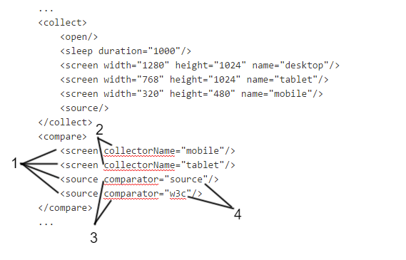

where:

1. Consumed resource type,
2. Special property: collectorName,
3. Special property: comparator,
4. Module name (comparator).


#### Accessibility Comparator

| ! Beta Version |
|:------------   |
| This AET Plugin is currently in BETA version. |

Accessibility Comparator is responsible for processing of collected accessibility validation result. It uses [html CodeSniffer](http://squizlabs.github.io/HTML_CodeSniffer/) library.

Module name: **accessibility**

Resource name: accessibility

##### Parameters

| Parameter | Value | Description | Mandatory |
| --------- | ----- | ----------- | --------- |
| `report-level` | ERROR (default)<br/><br/> WARN<br/><br/> NOTICE | Only violations of type ERROR are displayed on report.<br/><br/> Violations of type WARN and ERROR are displayed on report.<br/><br/> All violations are displayed on report. | no |
| ignore-notice | boolean<br/> (default: `true`) | If `ignore-notice=true` test status does not depend on the notices amount.<br/> If `ignore-notice=false` notices are treated as warnings in calculating test status. Enforces report-level = NOTICE. | no |
| `showExcluded` | boolean<br/> (default: `true`) | Flag that says if excluded issues (see [[Accessibility Data Filter|AccessibilityDataFilter]]) should be displayed in report. By default set to `true`. | no |

##### Example Usage

```xml
<?xml version="1.0" encoding="UTF-8" ?>
<suite name="test-suite" company="cognifide" project="project">
    <test name="accessibility-test">
        <collect>
            ...
            <accessibility />
            ...
        </collect>
        <compare>
            ...
            <accessibility report-level="WARN" />
            ...
        </compare>
        <urls>
        ...
        </urls>
    </test>
    ...
    <reports>
        ...
    </reports>
</suite>
```


#### Client Side Performance Comparator

| ! Beta Version |
|:------------   |
| This AET Plugin is currently in BETA version. |

Client Side Performance Comparator is responsible for processing of collected client side performance analysis result. Comparator uses [YSlow](http://yslow.org/) tool in order to perform comparison phase on collected results.

Module name: **client-side-performance**

Resource name: client-side-performance

##### Parameters

No parameters  

##### Example Usage

```xml
<?xml version="1.0" encoding="UTF-8" ?>
<suite name="test-suite" company="cognifide" project="project">
    <test name="client-side-performance-test">
        <collect>
            ...
            <client-side-performance />
            ...
        </collect>
        <compare>
            ...
            <client-side-performance />
            ...
        </compare>
        <urls>
        ...
        </urls>
    </test>
    ...
    <reports>
        ...
    </reports>
</suite>
```


#### Cookie Comparator

Cookie Comparator is responsible for processing of collected cookies. This can be simply listing of collected cookies, verifying if cookie exists or comparing collected cookie with pattern.

Cookie feature allows to collect patterns and can be rebased from report only in compare action mode*.*

Module name: **cookie**

Resource name: cookie

##### Parameters

| Parameter | Value | Description | Mandatory |
| --------- | ----- | ----------- | --------- |
| `action` | list<br/><br/> test<br/><br/> compare | Displays the list of cookies<br/><br/> Tests if cookie with the given name and value exists<br/><br/> Compares the current data with the pattern (compares only cookie names, values are ignored) | no<br/><br/> If `action` parameter is not provided, default `list` action is performed |
| `cookie-name` |  | Name of the cookie to test, applicable only for test action | yes, if `action` set to `test` |
| `cookie-value` |   | Value of the cookie to test, applicable only for test action | no |
| `showMatched` | boolean<br/> (default: `true`) | **Works only in compare mode.** Flag that says if matched cookies should be displayed in report. By default set to `true`. | no |

##### Example Usage

```xml
<?xml version="1.0" encoding="UTF-8" ?>
<suite name="test-suite" company="cognifide" project="project">
    <test name="cookie-test">
        <collect>
            ...
            <cookie />
            ...
        </collect>
        <compare>
            ...
            <cookie />
            ...
        </compare>
        <urls>
        ...
        </urls>
    </test>
    ...
    <reports>
        ...
    </reports>
</suite>
```


#### JS Errors Comparator

JS Errors Comparator is responsible for processing of collected javascript errors resource. In this case it is simply displaying list of javascript errors.

JS Errors feature do not allow to collect patterns, so it does not compare results with any patterns - rebase action is also not avaliable.

Module name: **js-errors**

Resource name: js-errors

##### Parameters

No parameters

##### Example Usage

```xml
<?xml version="1.0" encoding="UTF-8" ?>
<suite name="test-suite" company="cognifide" project="project">
    <test name="js-errors-test">
        <collect>
            ...
            <js-errors />
            ...
        </collect>
        <compare>
            ...
            <js-errors />
            ...
        </compare>
        <urls>
        ...
        </urls>
    </test>
    ...
    <reports>
        ...
    </reports>
</suite>
```

| ! Important information |
|:----------------------- |
| [[JS Errors Data Filter|JSErrorsDataFilter]] can be applied to collected javascript errors result before comparison to modify data that is to be processed. |


#### Layout Comparator

Layout Comparator is responsible for comparing collected screenshot of page with pattern. This is default comparator for `screen` resource.

Can be rebased from report.

Module name: **layout**

Resource name: screen

##### Parameters

No parameters

##### Example Usage

```xml
<?xml version="1.0" encoding="UTF-8" ?>
<suite name="test-suite" company="cognifide" project="project">
    <test name="layout-compare-test">
        <collect>
            ...
            <screen />
            ...
        </collect>
        <compare>
            ...
            <screen comparator="layout" />
            ...
        </compare>
        <urls>
        ...
        </urls>
    </test>
    ...
    <reports>
        ...
    </reports>
</suite>
```

##### Fast pre-comparison

Since AET 1.3 fast comparison of screenshots will be implemented. Taken screenshot MD5 will be matched against current pattern. If hashes will be the same, screenshot will be treated as one without differences and no further comparison will be performed.


#### Source Comparator

Source Comparator is responsible for comparing collected page source with pattern.

Can be rebased from report.

Module name: **source**

Resource name: source

##### Parameters

| Parameter | Value | Description | Mandatory |
| --------- | ----- | ----------- | --------- |
| `compareType` | content | Compare only text inside HTML nodes. Ignore formatting, tag names and attributes. |  no<br/> If `compareType` is not provided default `all` value is taken. |
|  | markup | Compare only HTML markup and attributes. Ignore text inside HTML tags, formatting and white-spaces. Remove empty lines. |  |
|  | allFormatted | Compare full source with formatting and white-spaces ignored. Remove empty lines. |  |
|  | all | Compare all source (default). |  |

##### Example Usage

```xml
<?xml version="1.0" encoding="UTF-8" ?>
<suite name="test-suite" company="cognifide" project="project">
    <test name="source-compare-test">
        <collect>
            ...
            <source />
            ...
        </collect>
        <compare>
            ...
            <source comparator="source" compareType="markup" />
            ...
        </compare>
        <urls>
        ...
        </urls>
    </test>
    ...
    <reports>
        ...
    </reports>
</suite>
```

| ! Important information |
|:----------------------- |
| [[Extract Element Data Filter|ExtractElementDataFilter]], [[Remove Lines Data Filter|RemoveLinesDataFilter]] and [[Remove Nodes Data Filter|RemoveNodesDataFilter]] can be applied to collected source before comparison to modify source data that is to be compared. |


#### Status Codes Comparator

Status Codes Comparator is responsible for processing collected status codes. In this case it is simply displaying the list of collected status codes from given page.

Status Codes feature do not allow to collect patterns, so it does not compare results with any patterns - rebase action is also not available.

Module name: **status-codes**

Resource name: status-codes

##### Parameters

| Parameter | Value | Example | Description | Mandatory |
| --------- | ----- | ------- | ----------- | --------- |
| `filterRange` | x,y | 400,500 | Defines range of status codes that should be processed | yes, if `filterCodes` is not present |
| `filterCodes` | x,y,z | 400,401,404 | List of status codes that should be processed | yes, if `filterRange` is not present |
| `showExcluded` | boolean (default: `true`) | true | Flag that says if excluded codes (see [[Status Codes Data Filters | StatusCodesDataFilters]]) should be displayed in report. By default set to `true`. | no |

##### Example Usage

```xml
<?xml version="1.0" encoding="UTF-8" ?>
<suite name="test-suite" company="cognifide" project="project">
    <test name="status-codes-test">
        <collect>
            ...
            <open />          
            ...
            <status-codes />
            ...
        </collect>
        <compare>
            ...
            <status-codes filterRange="400,404" />
            ...
        </compare>
        <urls>
        ...
        </urls>
    </test>
    ...
    <reports>
        ...
    </reports>
</suite>
```


#### W3C HTML5 Comparator

W3C HTML5 Comparator is responsible for validating collected page source against w3c standards using [validator.nu](https://validator.nu/). HTML5 is supported by this library.

W3C HTML5 feature do not allow to collect patterns, so it does not compare results with any patterns - rebase action is also not available.

Module name: **w3c-html5**

Resource name: source

##### Parameters

| Parameter | Value | Description | Mandatory |
| --------- | ----- | ----------- | --------- |
| `ignore-warnings` | boolean (default: true) | If `ignore-warnings="true"` test status does not depend on the warnings amount, otherwise warnings counts as w3c errors when computing testcase status. | no |
| `errors-only` | boolean(default: true) | **This parameter will be removed from 1.5 AET Version!**<br/> Has the same result as `ignore-warnings` parameter. | no |

| ! Mandatory parameter |
|:--------------------- |
| Please remember, that using parameter `comparator="w3c-html5"` is mandatory while defining this comparator. More information about this parameter can be found in [[Comparators]] section. |

##### Example Usage

```xml
<?xml version="1.0" encoding="UTF-8" ?>
<suite name="test-suite" company="cognifide" project="project">
    <test name="w3c-html5-test">
        <collect>
            ...
            <open />          
            ...
            <source />
            ...
        </collect>
        <compare>
            ...
            <source comparator="w3c-html5" />
            ...
        </compare>
        <urls>
        ...
        </urls>
    </test>
    ...
    <reports>
        ...
    </reports>
</suite>
```


### Data Filters

Data filters are modules which narrow area on which comparison will be performed.

They are nested in [[Comparators]] and apply only to instance of comparator in which they are defined.

Each data filter consists of two elements:
* module name,
* parameters.

##### Module name

This name is unique identifier for each data filter (and each module in compare phase).

##### Parameters

This is set of key-value pairs using which user can pass some configuration and information to data filter. Parameters can be divided into two groups:

* mandatory - parameters without which filtering will be not possible,
* optional - passing this parameter is not obligatory, usually they trigger some functionality extension.


#### Accessibility Data Filter

Accessibility Data Filter filters Accessibility issues - it removes matched accessibility issues from reports.  
This filter can be only applied to `accessibility` comparator tag in test case.  
When more than one parameter is provided then only fully matched issues are filtered.

Module name: **accessibility-filter**

Resource name: accessibility

##### Parameters

| Parameter | Value | Description | Mandatory |
| --------------- | ----- | ----------- | --------- |
| `error` | string error | Exact error message | At least one of parameter is required |
| `principle` | string principle | Exact accessibility issue principle |
| `line` | integer line number | Line number in file in which issue occurred |
| `column` | integer column number | Column number in file in which issue occurred |

##### Example Usage

In this sample exact match of accessibility issue breaking principle "WCAG2A.Principle4.Guideline4_1.4_1_2.H91.Button.Name", at line 21, column 5 with message "This button element does not have a name available to an accessibility API. Valid names are: title attribute, element content." will be totally ignored.

```xml
<?xml version="1.0" encoding="UTF-8" ?>
<suite name="test-suite" company="cognifide" project="project">
    <test name="accessibility-filter-test">
        <collect>
            ...
            <open/>
            ...
            <accessibility/>
            ...
        </collect>
        <compare>
            ...
            <accessibility>
                <accessibility-filter
                    error="This button element does not have a name available to an accessibility API. Valid names are: title attribute, element content."
                    principle="WCAG2A.Principle4.Guideline4_1.4_1_2.H91.Button.Name"
                    line="21"
                    column="5" />
            </accessibility>
            ...
        </compare>
        <urls>
            ...
        </urls>
    </test>
    ...
    <reports>
        ...
    </reports>
</suite>
```

There can be more than one `accessibility-filter` tag in `accessibility` comparator eg:

```xml
<accessibility>
    <accessibility-filter principle="WCAG2A.Principle1.Guideline1_3.1_3_1.F68" />
    <accessibility-filter error="This select element does not have a name available to an accessibility API. Valid names are: label element, title attribute." />
    <accessibility-filter line="270" />
    <accessibility-filter line="314" />
    <accessibility-filter column="5" />
</accessibility>
```


#### Extract Element Data Filter

Extract Element Data Filter allows to extract element from html source (collected by Source Collector) by providing id attribute or class attribute. Found element's source is processed by comparator.

Module name: **extract-element**

Resource name: source

##### Parameters

| Parameter | Value | Description | Mandatory |
| --------- | ----- | ----------- | --------- |
| `elementId` | HTML id | Id for element to extract | See note below |
| `class` | HTML class | Class name for element to extract | See note below |

| ! Note |
|:------ |
| One of these parameters is required. Only one parameter (either `elementId` attribute or `class` attribute) can be provided. |

##### Example Usage

```xml
<?xml version="1.0" encoding="UTF-8" ?>
<suite name="test-suite" company="cognifide" project="project">
    <test name="extract-element-test">
        <collect>
            ...
            <open/>
            ...
            <source/>
            ...
        </collect>
        <compare>
            ...
            <source comparator="source">
                <extract-element elementId="login_form"/>
            <!-- OR -->
                <extract-element class="class_form"/>
            </source>
            ...
        </compare>
        <urls>
            ...
        </urls>
    </test>
    ...
    <reports>
        ...
    </reports>
</suite>
```


#### JS Errors Data Filter

Js Errors Data Filter filters JS Errors Collector result - it removes matched javascript errors from reports.  
This filter can be only applied to `js-errors` comparator tag in test case.  
When more than one parameter is provided then only fully matched errors are filtered.  
If some XML-specific charactes (e.g. `&`) are in parameter's value, then they must be escaped.

Module name: **js-errors-filter**

Resource name: js-errors

##### Parameters

| Parameter | Value | Description | Mandatory |
| --------- | ----- | ----------- | --------- |
|`error`|string error|Exact error message|At least one of parameter is required|
|`source`|string file name|Source file name (full path including `http://`) in which error occurred|
|`line`|integer line number|Line number in file in which error occurred|

##### Example Usage

In this sample exact match of js error from file  "[http://w.iplsc.com/external/jquery/jquery-1.8.3.js](http://w.iplsc.com/external/jquery/jquery-1.8.3.js)", line 2 with message "Error: Syntax error, unrecognized expression: .iwa_block=pasek-ding" will be totally ignored (not included in report)

```xml
<?xml version="1.0" encoding="UTF-8" ?>
<suite name="test-suite" company="cognifide" project="project">
    <test name="js-errors-filter-test">
        <collect>
            ...
            <open/>
            ...
            <js-errors/>
            ...
        </collect>
        <compare>
            ...
            <js-errors>
                <js-errors-filter
                    error="Error: Syntax error, unrecognized expression: .iwa_block=pasek-ding"
                    line="2"
                    source="http://w.iplsc.com/external/jquery/jquery-1.8.3.js" />
            </js-errors>
            ...
        </compare>
        <urls>
            ...
        </urls>
    </test>
    ...
    <reports>
        ...
    </reports>
</suite>
```

There can be more than one `js-errors-filter` tag in `js-errors` comparator eg:

```xml
<js-errors>
    <js-errors-filter error="Error: Syntax error, unrecognized expression: .iwa_block=pasek-ding" />
    <js-errors-filter source="http://w.iplsc.com/external/jquery/jquery-1.8.3.js"
                      line="2" />
</js-errors>
```


#### Remove Lines Data Filter

Remove Lines Data Filter allows to remove lines from compared source (data or pattern). This may be helpful when we need to compare page sources with dynamic content. We can then remove these dynamic content markup.

Line number in reports represents lines state after modification, so have in mind that marked lines have different lines number in real source.

Module name: **remove-lines**

Resource name: source

##### Parameters

| Parameter | Value | Description | Mandatory |
| --------- | ----- | ----------- | --------- |
|`dataRanges`|ranges of lines to remove from data|Ranges should be provided in form **a,b**, this will be interpreted as closed interval of integers [a,b].Particular ranges should be separated by semicolons: **a,b;c,d;e,f** a>0, b>0|At least one of parameters is required.|
|`patternRanges`|ranges of lines to remove from pattern|Ranges should be provided in form **a,b**, this will be interpreted as closed interval of integers [a,b].Particular ranges should be separated by semicolons: **a,b;c,d;e,f** a>0, b>0||

Examples:

Suppose we want to remove line 10: `10,10`

Suppose we want to remove lines from 10 to 15: `10,15`

Suppose we want to remove lines from 10 to 15, line 27 and lines from 30 to 38: `10,15;27,27;30,38`

##### Example Usage

```xml
<?xml version="1.0" encoding="UTF-8" ?>
<suite name="my-test-suite" company="cognifide" project="project">
    <test name="remove-lines-test">
        <collect>
            ...
            <source/>
            ...
        </collect>
        <compare>
            ...
            <source comparator="source">
                <remove-lines dataRanges="10,15;27,27" patternRanges="10,14;27,28"/>
            </source>
            ...
        </compare>
        <urls>
            ...
        </urls>
    </test>
    ...
    <reports>
        ...
    </reports>
</suite>
```


#### Remove Nodes Data Filter

Remove Nodes Data Filter allows to delete some node(s) from html tree. Node(s) are defined by xpath selector.

| ! Important information |
|:----------------------- |
| Html source has to be valid xml document |

Name: **remove-nodes**

Resource name: source

##### Parameters

| Parameter | Value | Description | Mandatory |
| --------- | ----- | ----------- | --------- |
| `xpath` | xpath_to_node| Xpath selector for nodes to remove | yes |

##### Example Usage

```xml
<?xml version="1.0" encoding="UTF-8"?>
<suite name="test-suite" company="Cognifide" project="project">
    <test name="remove-nodes-test">
        <collect>
            ...
            <open/>
            ...
            <source/>
            ...
        </collect>
        <compare>
            ...
            <source comparator="source">
                <remove-nodes xpath="//*[@id='blueBarNAXAnchor']/div/div/div/a/i"/>
            </source>
            ...
        </compare>
        <urls>
            ...
        </urls>
    </test>
    <reports>
        ...
    </reports>
</suite>
```


#### Remove Regex Data Filters

Remove Regex Data Filter allows to remove parts of source based on regex expressions from compared source (data and/or pattern).   
This may be helpful when we need to compare page sources with dynamic content. We can then remove these dynamic content markup.  
See also Remove Lines and Remove Nodes data Filters.

Module name: **remove-regexp**

Resource name: source

##### Parameters

| Parameter | Value | Mandatory |
| --------- | ----- | --------- |
| `dataRegExp` |RegExp that will replace matched parts of *data* sources  |At least one of parameter is required. |
| `patternRegExp` | RegExp that will replace matched parts of *pattern* sources |
| `regExp` | RegExp that will replace matched parts of  *pattern and data* sources |

| ! Note |
|:------ |
| `regExp` value overrides `dataRegExp` and `patternRegExp` |

Tip:  
Use [http://www.regexplanet.com/advanced/java/index.html](http://www.regexplanet.com/advanced/java/index.html) to create  check your Regular Expression and when ready use 'as a Java string' value in your testsuite.

##### Example Usage

```xml
<?xml version="1.0" encoding="UTF-8" ?>
<suite name="my-test-suite" company="cognifide" project="project">
    <test name="remove-regex-test">
        <collect>
            ...
            <source/>
            ...
        </collect>
        <compare>
            ...
            <source comparator="source">
                 <remove-regexp regExp='\"correlationId\": \".*\"'/>
            </source>
            ...
        </compare>
        <urls>
            ...
        </urls>
    </test>
    ...
</suite>
```


#### Status Codes Data Filters

##### Exclude Filter

Exclude Filter removes from reports Status Codes results that match specified parameters.  

Name: **exclude**

Resource name: status-codes

###### Parameters

| Parameter | Value | Description | Mandatory |
| --------- | ----- | ----------- | --------- |
| `url` | String url | Exact url to be removed from results. | At least one of parameter is required. |
| `pattern` | String regex pattern| Regex pattern that urls should match to be removed from results. | |

If both parameters are provided then result is removed when it matches at least one of the parameters.

###### Example Usage

In this sample match results with url http://www.cognifide.com/_cog_opt_js_f359581ea4bd3379b4c25591838a5dd8.js or url that matches pattern **^.\*js$** will be ignored (not included in report).

```xml
<?xml version="1.0" encoding="UTF-8"?>
<suite name="test-suite" company="Cognifide" project="project">
    <test name="exclude-test" useProxy="rest">
        <collect>
            ...
            <open/>
            ...
            <status-codes/>
            ...
        </collect>
        <compare>
            ...
            <status-codes filterRange="200,999">
                <exclude url="http://www.cognifide.com/_cog_opt_js_f359581ea4bd3379b4c25591838a5dd8.js" pattern="^.*js$"/>
            </status-codes>
            ...
        </compare>
        <urls>
            ...
        </urls>
    </test>
    <reports>
        ...
    </reports>
</suite>
```

There can be more than one `exclude` tags in `status-codes` comparator. They are processed in turns. Example below is equivalent to defined above:

```xml
<status-codes>
    <exclude url="http://www.cognifide.com/_cog_opt_js_f359581ea4bd3379b4c25591838a5dd8.js"/>
    <exclude pattern="^.*js$"/>
</status-codes>
```

In this case both results with url http://www.cognifide.com/_cog_opt_js_f359581ea4bd3379b4c25591838a5dd8.js and urls that match pattern **^.\*js$** (ending with js) will not be displayed on reports.

**Exclude** and **include** modifiers can be both applied to **status-codes comparator**. They are processed in turns. Example:

```xml
<status-codes>
    <include pattern="^.*js$"/>
    <exclude url="http://www.cognifide.com/_cog_opt_js_f359581ea4bd3379b4c25591838a5dd8.js"/>
</status-codes>
```

In this case, at first all urls that do not match **^.\*js$** pattern are removed. Then url http://www.cognifide.com/_cog_opt_js_f359581ea4bd3379b4c25591838a5dd8.js is removed. Therefore only urls ending with `js` except http://www.cognifide.com/_cog_opt_js_f359581ea4bd3379b4c25591838a5dd8.js will be included in reports.

##### Include Filter

Include Filter removes from reports Status Codes results that **do not** match specified parameters.  

Name: **include**

Resource name: status-codes

###### Parameters

| Parameter | Value | Description | Mandatory |
| --------- | ----- | ----------- | --------- |
| `url` | String url | Exact url to be included in reports. Results that do not match will be removed. | At least one of parameter is required. |
| `pattern` | String regex pattern | Regex pattern that urls should match to be included in reports. Results that do not match will be removed. | |

If both parameters are provided then result is only included in the report when it matches both of the parameters.

###### Example Usage

In example below **only** result with url http://www.cognifide.com/_cog_opt_js_f359581ea4bd3379b4c25591838a5dd8.js will be included in report.

```xml
<?xml version="1.0" encoding="UTF-8"?>
<suite name="test-suite" company="Cognifide" project="project" environment="win7-ff16">
    <test name="include-test" useProxy="rest">
        <collect>
            ...
            <open/>
            ...
            <status-codes/>
            ...
        </collect>
        <compare>
            ...
            <status-codes filterRange="200,999">
                <include url="http://www.cognifide.com/_cog_opt_js_f359581ea4bd3379b4c25591838a5dd8.js"/>
            </status-codes>
            ...
        </compare>
        <urls>
            ...
        </urls>
    </test>
    <reports>
        ...
    </reports>
</suite>
```

There can be more than one `include` tags in `status-codes` comparator. They are processed in turns. Example:

```xml
<status-codes>
    <include pattern="^.*js$"/>
    <include url="http://www.cognifide.com/_cog_opt_js_f359581ea4bd3379b4c25591838a5dd8.js"/>
</status-codes>
```

In this case only http://www.cognifide.com/_cog_opt_js_f359581ea4bd3379b4c25591838a5dd8.js url will be included on reports: first all results that do not match **^.\*js$** pattern (ending with `js`) are removed. Then within that result all urls different that "http://www.cognifide.com/_cog_opt_js_f359581ea4bd3379b4c25591838a5dd8.js" are removed.

In example above, first `<include>` can be omitted and result will be the same.

**Include** and **exclude** modifiers can be both applied to **status-codes comparator**. They are processed in turns. Example:

```xml
<status-codes>
    <include pattern="^.*js$"/>
    <exclude url="http://www.cognifide.com/_cog_opt_js_f359581ea4bd3379b4c25591838a5dd8.js"/>
</status-codes>
```

In this case only first all urls that do not match **^.\*js$** pattern are removed. Then url http://www.cognifide.com/_cog_opt_js_f359581ea4bd3379b4c25591838a5dd8.js is removed. Therefore only urls ending with `js` except http://www.cognifide.com/_cog_opt_js_f359581ea4bd3379b4c25591838a5dd8.js will be included in reports.


#### W3C HTML5 Issues Filter

W3C HTML5 Issues Filter allows to exclude some W3C HTML5 issues from result. Excluded issues will appear at the bottom of issues table and won't be taken into account when calculating status.

Name: **w3c-filter**

Resource name: source

Comparators: **w3c-html5**

### Parameters

| Parameter | Value | Description | Mandatory |
| --------- | ----- | ----------- | --------- |
| `message` | string | Prefix or all message text of issue to be filter out | At least one of params should be used and all of used params should be not empty. |
| `line` | integer | Line in source file where issue appear | |
| `column` | integer | Column in source file where issue appear | |

| ! Note |
|:------ |
| If there are some If some XML-specific charactes (e.g. `&`) are in parameter's value, then they have to be escaped. See example below. |

##### Example Usage for w3c-html5 comparator

```xml
<?xml version="1.0" encoding="UTF-8"?>
<suite name="test-suite" company="Cognifide" project="project" environment="win7-ff16">
    <test name="remove-nodes-test">
        <collect>
            ...
            <open/>
            ...
            <source/>
            ...
        </collect>
        <compare>
            ...
            <source comparator="w3c-html5" errors-only="false">
                <w3c-filter message = "The first occurrence of" />
                <w3c-filter message = "&#8220;&amp;&#8221; did not start a character reference"/>
                <w3c-filter line="1" column="119"/>
            </source>
            ...
        </compare>
        <urls>
            ...
        </urls>
    </test>
    <reports>
        ...
    </reports>
</suite>
```

#### Urls

`<urls>` element lists all urls which will be processed within current test. Contains one or more **[url](#url)** elements.

##### url
A single url which will be processed by particular test.

###### Parameters

| Attribute name | Description | Mandatory |
| -------------- | ----------- | --------- |
| `href` | Page address (also see note under name attribute) | yes |
| `name` | Identifier for url. It is used to identify data for url. If provided should be unique for each test in test suite. If not provided is set to encoded `href` value. Should consists only of letters, digits and/or characters: `-`, `-`. Note that if `href=""` with provided url `name` attribute and suite `domain` attribute is also valid | no |
| ~~`description`~~ | ~~Additional description for url that will be shown in html report~~ | no longer supported |

###### Example Usage

```xml
<?xml version="1.0" encoding="UTF-8" ?>
<suite name="test-suite" company="cognifide" project="project">
    <test name="urls-test">
        <collect>
            ...
        </collect>
        <compare>
            ...
        </compare>
        <urls>
            <url href="http://www.example.com"/>
            ...
        </urls>
    </test>
    ...
    <reports>
        ...
    </reports>
</suite>
```


## Suite Report

### What is suite report?
Suite Report is testing results' presentation. It's composed of single tests. Each of them contains one or more URLs, on which tests were run.

| ! Important information |
|:----------------------- |
|AET reports are tested and written for Google Chrome web browser. |

Each test's result will be presented in one of three colors:

* **green** - if all group result passed and no risks was detected,
* **yellow** - if there is small risk detected,
* **red** - if there were some risks detected and result requires inspection

There is also 4th colour, which is not correlated with test's results. It is **blue**, which appears when user accepts certain pattern.

Report is made up of 3 main parts (see also screenshot below):

* toolbar,
* sidepanel (which contains two sub-parts):
  * filtering,
  * navigation-tree,
* main.


With given suite report you can:

* accept or revert patterns,
* create notes,
* filter results,
* search for specific test/URL,
* navigate on report with keyboard shortcuts.

For more information about AET reports' features see [[AET Report Features|SuiteReportFeatures]].

### Levels of report

The highest report's level is suite. Every suite contains tests and the certain test contains one or more URLs on which tests are run.

#### Suite
On this level you can see such information as:

* all tests which was launched via certain suite,
* project name,
* test cases' status,
* date and time of running the test suite.

#### Test
If you go to the certain test level, you can obtain information about:

* test case's name,
* status' representation of tested URLs,
* URLs included in the test.

#### URL with Cases Tabs
On URL level you can learn about:

* cases on which certain site was tested (represented as tabs on upper part of report),
* test case's details for given URL.


### Test cases

#### Cookies

##### Description
Cookie test results can be presented in three diffrent forms which depend on the action parameter defined in test definition. The forms are:

* list,
* test,
* compare.

##### List

###### Description
Lists all cookies found on the tested page. This result will always have success status.


##### What vulnerabilities it discovers
You can check all of site's cookies in order to find the invalid one. However, this mode is not intended to discover website issues. This list should be empty when tested page does not intend to use cookies and The EU Cookie Law is respected.

##### Test

###### Description
It shows result of checking presence of cookie with defined parameters on the tested page.


In case of cookie being not found on the page or having an unexpected value the result is marked as risk (red).


##### What vulnerabilities it discovers
There are a few things you should pay attention to:

* lack of a cookie that occurred before might be caused by some website error (e.g. bug in system functionality),
* lack of a cookie might result in further system erros (e.g. losing some user specific data),
* lack of an important cookie (e.g. cookie with user localization data) may cause a page to be dispalyed improperly.

##### Compare

###### Description
Cookies found on the tested page are compared to the others, which were saved in the pattern (if there is no pattern, then cookies collected during the first page entry are set as the pattern). Differences are searched only for cookies' names. Result will be successful if all found cookies' names are identical to those in the pattern.

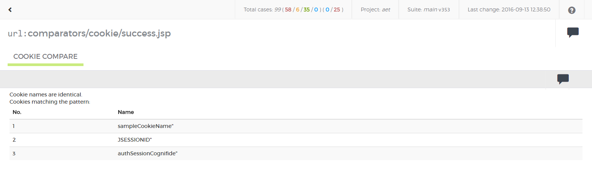

Otherwise the result in the report will be marked as at risk (red). Differences will be presented in the form (see "1" on screenshot below) and there will be "accept test case" action available (see "2" on screenshot below).


##### What vulnerabilities it discovers
* lack of a cookie that occurred before might be caused by some website error (e.g. bug in system functionality),
* lack of a cookie might result in further system erros (e.g. losing some user specific data),
* an additional cookie may be generated by some unwanted content on a page (e.g. some 3rd party software add own cookies),
* when a page does not intend to use cookies and The EU Cookie Law is respected, lists of additional and detected cookies should always be empty.

#### JS Errors

##### Description
This case displays success status when there were no JS errors found.

| ! Important information |
|:----------------------- |
|All errors filtered with [[JS Errors Data Filter|JSErrorsDataFilter]] are ommited. |


Otherwise the report is marked as risk (red) when at least one error has been found.

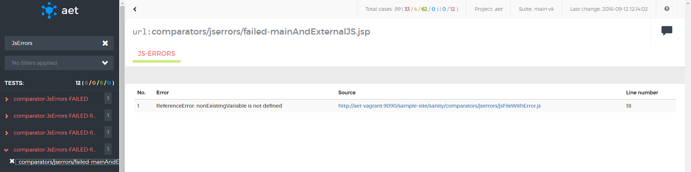

##### What vulnerabilities it discovers
* JS Errors can cause improper behaviour of a page (e.g. dynamic components may not work properly in some (or even all) browsers,
* JS Error can also occur when good practices are not followed in the javascript code.

#### Screen - layout

##### Description
For layout tests the results are presented as compared screenshots (as on screenshot below). 


1. Test case's name (red font means failure).
2. "Accept test case" button (available only when differences have been detected).
3. "Show mask" switch - when the mask is on, differences are marked in a red colour over the collected screenshot, otherwise a raw screenshot is presented.
4. Pattern - a screen which the "view" is compared to (if there is no pattern, the first collected screenshot is saved as the pattern).
5. View - a screen that was taken during the test and it is compared to the pattern.
6. Example of difference area.
7. Date of obtaining current pattern.

Test case's result is marked as successful when there is no difference between view and pattern (see screenshot below).


##### What vulnerabilities it discovers
* Differences found in page screenshots may indicate undesired changes in the page layout (css, html structure) e.g. when a new functionality was implemented 
in a system it may have an impact on another system component(s). This may show itself as a changed page layout.
* Content changes can be divided into two groups: wanted (are intended) and unwanted (a result of a mistake or an error). 
An example of a change that is not a defect (wanted) is: the carousel component with the latest news items displayed or the twitter component displaying latest tweets. 
In order to avoid detecting these sorts of changes in these dynamic components, the user can use the [[Hide Modifier|HideModifier]] feature in the suite definition. 
Another example of the ‘wanted’ dynamic content is a cookies policy popup that may be hidden using the [[Cookie Modifier|CookieModifier]].

#### Source

##### Description
Source test cases' results display compared sources. (see screenshot below).

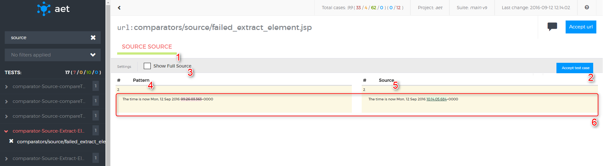

1. Test case's name (red font means failure),
2. "Accept test case" button (available only when differences have been detected),
3. "Show full source" switch - when the switch is off only differences are shown on the screen, otherwise full source is shown,
4. Pattern - source file to which collected source is compared. When there is no pattern, first collected source is saved as pattern automatically,
5. Source - source file which is compared with pattern,
6. Sample block with visible differences (e.g. changed characters).

Test case's result is marked as successful when there is no difference between source and pattern (see screenshot below).

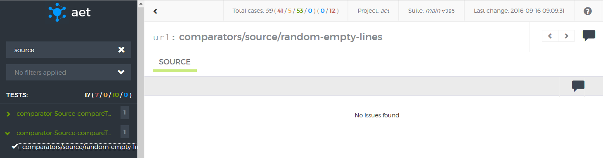

##### What vulnerabilities it discovers
* Differences found by source comparison may indicate undesired changes in a page layout (html structure) and content, 
e.g. when a new functionality is implemented in a system it might have an impact on other system component(s). 
This may occur as a changed page source.
* Content changes can be divided into two groups: wanted (intended) and unwanted (result of a mistake or an error). 
In order to filter out wanted changes and detect changes that are a result of a mistake or an error, the user can use one of following filters in the suite definition:
  * [[The Extract Element Data Modifier|ExtractElementDataFilter]] (e.g. to find changes only in the main menu that has the parameter id='main-menu' set),
  * [[The Remove Lines Data Filter|RemoveLinesDataFilter]] (to remove lines that changes every time - e.g. a current timestamp),
  * [[The Remove Nodes Data Filter|RemoveNodesDataFilter]] (e.g. to remove content displayed by the dynamic news carousel component).


#### Status codes

##### Description
In this test case you can check response codes from certain URLs. There is possibility of excluding individual codes, URLs and patterns (they are ignored by that test) 
as well as including them (only them will be tested by that test). For more information about excluding/including see [[Status Codes Data Filters|StatusCodesDataFilters]].

If any code is filtered by certain test, the result is failure (see screenshot below).

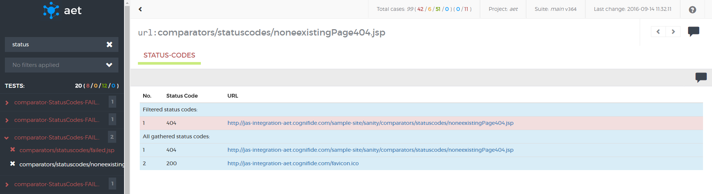

Otherwise test's result is successful (like on the screenshot below).

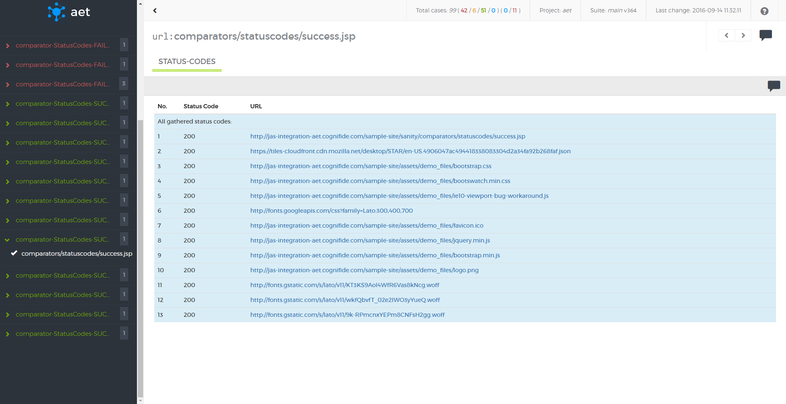

Additionally, if [[excluding filter|StatusCodesDataFilters]] is used, excluded codes are presented in additional section.

##### What vulnerabilities it discovers
* All status codes with a number higher than 400 are potential errors and indicate that the resource that is used by a page is unreachable (e.g. a page logo image, a page layout css file)
* Status code errors affect SEO (e.g. google page ranking is lowered for pages with 404 status codes).


#### W3C (HTML5)
##### Description
| ! Important information |
|:----------------------- |
|W3C validator is compatible with HTML5 standard. |
W3C report results display page source W3C validation output. If no W3C errors were found, result is marked as success - green (see screenshot bellow).


There is possibility to see warning (yellow), if W3C warnings were present and parameter `ignore-warnings` was set to false (as on screenshot bellow).

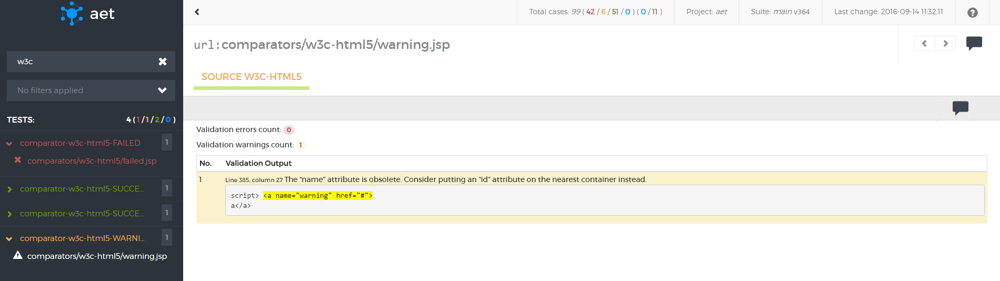

If at least one W3C validation error was found, report is marked as risk - red (see screenshot bellow).

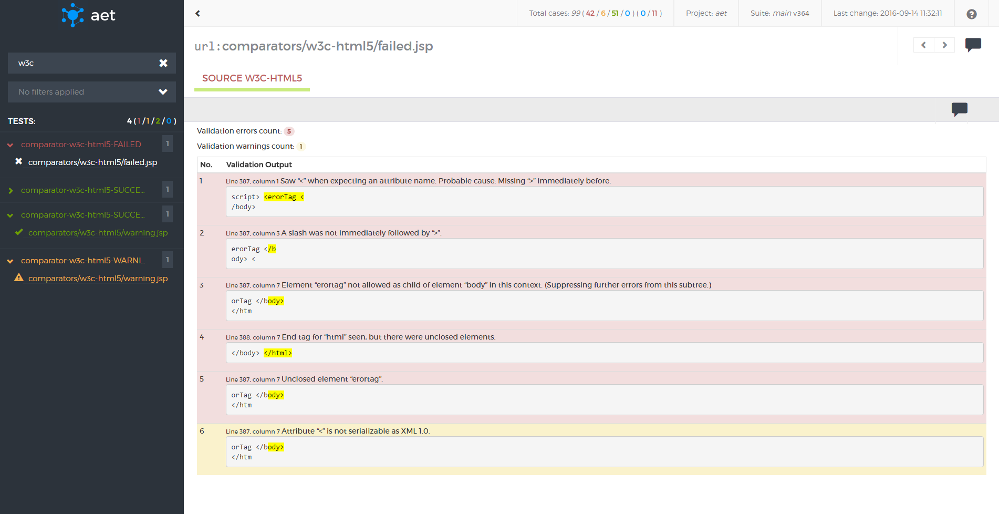

Result shows total count of validation errors and validation warnings.

##### What vulnerabilities it discovers
* The W3C validation is important from the SEO point of view. Pages that do not comply to  W3C standards are ranked low in Google PageRank and other rankings.
* Detected W3C errors may indicate serious html structure bugs (e.g. tags that haven't been closed) or content issues (e.g. invalid tags parameters: `<a>` without href).
* Maintenance of pages that follow W3C standards is much easier to carry out because pages that keep these standards are much less prone to be displayed differently in different browsers or devices.
* The W3C validation can also reveal page encoding and special characters displaying issues.


#### Accessibility

##### Description
| ! Important information |
|:----------------------- |
|This feature is currently in BETA version.|

This test case's result displays validation output of page accessibility analysis. Result shows total count of errors, warnings and notices about possible violations. Output presented on this report comes from [html CodeSniffer](http://squizlabs.github.io/HTML_CodeSniffer/) library.

Result is successful if there are no errors, warnings or notices (see screenshot below).


If there is no error, but several warnings or notices appear, the result is marked as warning (see screenshot below).
 


If any error occurs, the result is marked as risk (see screenshot below).


##### What vulnerabilities it discovers
* When page fails accessibility tests it could mean that it couldn't access information, e.g. there are images on page without description or alt attribute, anchors elements don't have link content, page styling and design is not clear enough for people with disabilities.
* Lack of accessibility could be against the law in some countries.

#### Client side performance

##### Description
| ! Important information |
|:----------------------- |
|This feature is currently in BETA version.|

Client side performance report results display validation output of performance analysis. Result shows overall score and the list of rules, which are graded individually. Each rule contains a description and optionally the list of components associated with the rule. Results presented on this report come from [YSlow](http://yslow.org/) tool. 


1. Test case name with status color.
2. Overall performance score (computed from subscores).
3. List of subscores (Each subscore is assigned a letter grade A through F, with A being the highest grade).
4. Description of subscore (only for score with grade worse than A).

If overall score is A, the report is marked as success.

If overall score is B to E, the report is marked as warning.

If overall score is F, the report is marked as risk.

##### What vulnerabilities it discovers
* Poor client side performance has negative impact on user experience.
* Pages with grade F are slow and probably user will not want to use them. They are especially difficult to load on mobile devices.
* Client side performance is taken into account by most of search engines. Good performance means better ranking.

### Features
#### Accepting/reverting patterns
There is possibility to accept failed test on each level (suite, test and URL) for the test cases in which the pattern is used (for now acceptable cases are: cookie compare, layout for screen and source "Source"). It is possible to revert certain acceptation, but for now only if changes are not saved. Accepting on suite level makes all acceptable test accepted, on test level it provides acceptation of each URL in certain test case. The lowest level is accepting certain URLs.

Accepting pattern example:


Reverting pattern example:


#### Notes creation
There is possibility to add notes to each level of the report. Notes are useful to give some information 
about test case e.g. why failed test was accepted.


#### Filtering test results
Every test case has one of the following states:

1. passed — if the comparator doesn't find any change, i.e. validation passes,
2. passed with warnings — if there are some warnings, but they are not very important,
3. failed — if the comparator detects some changes or some validation rules are broken,
4. accepted — if failed test was accepted.
The state of the test case is propagated to the URL then to the test and to the test suite. It is possible to accept all test cases for a given URL or in a current test suite.

Tests and URLs may be filtered by:

* text included in the test name or URL,
* test status.

Filtering by status works as an alternative: if one selects passed and failed tests both should be visible.


#### Searching for specific test/URL
It is possible to search tests and URLs by the query. Searched fields are the URL and test name.


#### Navigation via keyboard shortcuts
* press **q** to expand/collapse all items
* press **e** to expand/collapse all error items
* use **[** / **]** to navigate between test's urls
* press **m** to show/hide layout mask (when available)
* press **←** / **→** to navigate between url's tabs

# How It Works
AET is distributed system that consists of modules deployed on 
[Apache Karaf](http://karaf.apache.org/) which communicate with each other using JMS Server - [Active MQ](http://activemq.apache.org/).
Data collected and results of tests processing are saved into Datastorage (which current implementation is [MongoDB](https://www.mongodb.com/)).
Additionally AET use [Browsermob](http://bmp.lightbody.net/) as requests proxy server and [Apache Server](https://httpd.apache.org/) as host server
for [[Reports Web Application|SuiteReport]].

Diagram below presents AET system and communication between AET system components:


#### Third-party software used by system
AET uses the following third party software as parts of the system:

| Software | Used version | Function |
| --------- | ----- | ----------- |
| [Apache ActiveMQ](http://activemq.apache.org/) | 	5.13.1 | JMS Sever used for communication between system components |
| [Apache Karaf](http://karaf.apache.org/) | 2.3.9 with 4.2.1 Apache Felix Framework. | OSGi container for AET bundles and REST API |
| [Apache Server](https://httpd.apache.org/) | 2.2.15 | Http server used to host [[Reports Web Application|SuiteReport]] |
| [Browsermob](http://bmp.lightbody.net/) | 	2.0.0 | Proxy server |
| [Firefox](https://ftp.mozilla.org/pub/firefox/releases/38.6.0esr/win32/en-US/) | 38.6.0 ESR (en-US) | 	Browser with Selenium (2.50.1) |
| [MongoDB](https://www.mongodb.com/) | 3.2.3 | 	System database |

## System Components

The AET System consists of 7 core units:

* The Client (AET Maven Plugin)
* The Runner cluster
* The Worker cluster
* The JMS Server
* The Database
* The REST API
* Reports web application

### AET System architecture


#### Client

The Client component has the following functions
* sending request to the *AET System*.  
* parsing the input *Test Suite* xml file.
* downloading the Report after the *Test Suite* run is finished.

#### Runner

The Runner is the heart of the system. It is responsible for consuming Client's request and dispatching it to Workers. It works similar to the Map-Reduce algorithm. During the execution of the suite, the Runner checks if the next phase can begin and when all the phases are finished the Runner informs the client about it.

#### Worker

The Worker is a single processing unit that can perform a specific task e.g. collect a screenshot using the *Firefox* browser in the *Windows 7* environment, collect a page source, compare two screenshots, check if the source of a page is W3C-complaint and many others.

#### JMS Server

The JMS Server is a communication hub for the whole system. Workers, runners and the client communicate with one another using JMS messages.

#### Database

The Database serves as the system storage. It stores all the results, reports and patterns.

#### REST API

The REST API for the stored data; the user can download the Report, collected sources, view screenshots and comparison results via the REST API.

### Third-party software used by system

AET uses the following third party software as parts of the system:

| Software | Used version | Function |
| -------- | ------------ | -------- |
|[Apache Karaf](http://karaf.apache.org/)|2.3.9 with 4.2.1 Apache Felix Framework.|OSGi container for AET bundles and REST API.|
|[Apache ActiveMQ](http://activemq.apache.org/)|5.13.1|JMS Sever used for communication between system components.|
|[MongoDB](https://www.mongodb.org/)|3.2.3|System database.|
|[Browsermob](http://bmp.lightbody.net/)|2.0.0|Proxy server.|
|[Firefox](https://ftp.mozilla.org/pub/firefox/releases/38.6.0esr/win32/en-US/)|38.6.0 ESR (en-US)|Browser with Selenium (2.50.1).|


### Client Application

The AET client application comes in the form of a plugin for the *Maven* build automation tool -- `aet-maven-plugin`. This plugin connects to the AET application in order to run the specified test suite.

#### Usage

In order to run tests you must create a *Maven* project and include `aet-maven-plugin` in the `pom.xml` file in the following way:

```xml
<plugin>
    <groupId>com.cognifide.aet</groupId>
    <artifactId>aet-maven-plugin</artifactId>
    <version>${aet.version}</version>
</plugin>
```

The plugin version is here specified as the *Maven* property `aet.version`. This allows to define the AET plugin version from the command line using `-Daet.version=x.y.z` option, where `x.y.z` is the version number.

`aet-maven-plugin` defines the `aet:run` *Maven* goal which needs to be executed in order to run test suite.

So if you want to run AET tests you must execute following command in the directory where the `pom.xml` file has been defined:
```
mvn aet:run -DtestSuite=FULL_PATH_TO_TEST_SUITE
```

##### Parameters

The `aet-maven-plugin` has a few parameters that configure its behaviour. The `testSuite` parameter already mentioned defines the path to the xml suite configuration file. All the parameters are described below:

| Parameter | Description | Default Value | Mandatory |
| --------- | ----------- | ------------- | --------- |
| `testSuite` | The full path to suite definition file (at least a file name with an extension, e.g. `testSuite.xml`).| suite.xml | no |
| `endpointDomain` | the URL to the main AET domain | http://localhost:8181 | no |
| `userName` | ActiveMQ user name. | karaf | no |
| `password` | ActiveMQ password. | karaf | no |
| `outTopic` | Active MQ outgoing queue name. | AET.runner-out | no |
| `inQueue` | Active MQ incomming queue name. | AET.runner-in | no |
| `domain` | Overrides the *domain* parameter value from the test suite definition. | - | no |
| `timeout` | Milliseconds to detect the timeout since the last message received from AET. This is useful to abort the test run if there is no activity for a long time. | 300000 (5 minutes) | no |
| `xUnit` | The flag that says if the xUnit report should be generated and downloaded.| false | no |

##### Test results

The result of successful command line execution of the AET test suite is the `redirect.html` file and, if the `xUnit` parameter is set to `true` (the suite is executed with the `-DxUnit=true` flag), also the `xunit-report.xml` file. Both files are generated in the `target` folder in the directory where the `pom.xml` file has been defined.

#### Examples

There are a few sample commands with a different parameter set below.

By default, `aet-maven-plugin` connects to the AET application using the port 8181 of localhost. If your AET application is deployed on the other machine e.g. under the URL `http://aet.example.com`, you can tell the plugin to connect to that machine in the following way:
```
mvn aet:run -DtestSuite=suite.xml -DendpointDomain=http://aet.example.com
```

If all URLs in your test suite point to a single domain, you can specify it so it is no longer needed to do it again in the suite file. Let's say you'd like to test some subpages of the English version of Wikipedia. Then you can specify the target domain in the following way:
```
mvn aet:run -DtestSuite=suite.xml -Ddomain=https://en.wikipedia.org
```

If you want the test run to fail if running it takes too much time, you can specify the timeout (in milliseconds) in the following way:
```
mvn aet:run -DtestSuite=suite.xml -Dtimeout=2000
```

If you want to generate the xUnit report to have test results displayed in Jenkins, you can set it in the following way:
```
mvn aet:run -DtestSuite=suite.xml -DxUnit=true
```


### Runner
Runner is the heart of the system. It is responsible for consuming client's request and dispatching it to Workers. 
It works similar to the Map-Reduce algorithm. During the execution of the suite, the Runner checks if the next phase can 
begin and when all the phases are finished the Runner informs the client about it.

Runner starts whole suite processing and is responsible for merging all results. See following diagram that shows sequence of suite processing:

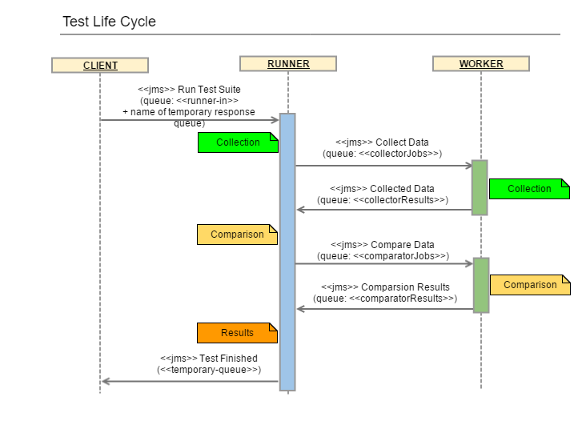

### Worker
The Worker is a single processing unit that can perform a specific task e.g. collect a screenshot using the Firefox browser, 
collect a page source, compare two screenshots, check if the source of a page is W3C-compliant and many others. 
Worker uses `jobs` to perform the tests. This module communicates with browser (Firefox).

Worker is responsible for executing single piece of work and returning it to the [[Runner|Runner]]. See following diagram that shows sequence of suite processing:


### REST API

Representational State Transfer API for accessing and modifying data stored in AET Database. REST API is part of AET System and is the interface between system database, user and application.

Its methods are used by *AET Maven Plugin* to download reports, *HTML Report* uses it to load images and to perform rebase action.  

Rebase (switching artifacts id of pattern(s)) and adding comments should be done on client side. REST API only consumes whole json representation of suite.  

#### REST API HTTP methods

Base api path:

`http://<Domain_or_IP_Address>:<PORT>/api`

|method|URL|HTTP Method|Parameters|Example|Description|
|------|---|-----------|----------|-------|-----------|
|get artifact by artifact Id|artifact|GET|company<br/> project<br/> id|http://aet.example.com/api/artifact?company=cognifide&project=example&id=56fa80c1ab21c61f14bfef45|Returns file from DB as "application/octet-stream" (even for json files), if not found or error occured json message with "application/json" content type is returned .|
|get metadata by correlationId|metadata|GET|company<br/> project<br/> correlationId | http://aet.example.com/api/metadata?company=cognifide&project=example&correlationId=cognifide-example-1459257500567 | Returns newest version of metadata identified by provided correlationId. |
|get metadata by suite name|metadata|GET|company<br/> project<br/> suite |http://aet.example.com/api/metadata?company=cognifide&project=example&suite=mysimplesuite | Returns newest version of latest run (identified by latest correlationId) of metadata by with provided suite name.|
|upade suite metadata|metadata|POST|raw JSON in POST body|http://aet.example.com/api/metadata [raw json in post body] | This method increments version number before saving to DB and returns updated suite object in json format.<br/><br/> Returns status 409 if given suite is locked.|
|get lock for suite|lock|GET|"company-project-name" as last part of path |http://aet.example.com/api/lock/cognifide-example-mysimplesuite | Returns lock status for given suite (true if it's locked or false in json)|
|try to set lock|lock|POST|`value` - additional info for lock (currently it's correlationId only)<br/><br/> "company-project-name" as last part of path | http://aet.example.com/api/lock/cognifide-example-mysimplesuite <br/><br/> [value=cognifide-example-mysimplesuite-12312454]|This methods sets lock only if there is no lock already set for given suite. Returns status 409 if given suite is already locked.|
|update heart beat|lock|PUT|`value` - additional info for lock (currently it's correlationId only)<br/><br/> "company-project-name" as last part of path | http://aet.example.com/api/lock/cognifide-example-mysimplesuite <br/><br/> [value=cognifide-example-mysimplesuite-12312454] | This method extends the duration of a lock for given suite. |
|gets list of all suites in system|config/list|GET| |http://aet.example.com/api/config/list | Returns all suites for all projects in all companies as html list of links to reports and metadatas<br> (this method will change or will be removed in near future- for now it stays only for devs and testing purposes). |
|get all locked suites|config/locks|GET| |http://aet.example.com/api/config/locks | Returns list of current locks. |
|get communication settings|config/communicationSettings|GET| | http://aet.example.com/api/config/communicationSettings | Returns current JMS broker settings and report app domain. This method is used by maven client. |


### Cleaner

The cleaner is a mechanism that removes obsolete data from the AET Database.

The cleaner is a scheduled task (using the Quartz Scheduler library with a [Cron expresion](https://docs.oracle.com/cd/E12058_01/doc/doc.1014/e12030/cron_expressions.htm)). There may be multiple cleaner instances running in the system, however it is recommended that they should not run in the same time (scheduled hours should be carefully picked).

#### Configuration

There are two parameters that define if the Suite in AET Database is obsolete:

* version,
* creation timestamp.

The **Version** of the suite is incremented each time the suite changes (e.g. during the next run of all suite tests or simply during suite rebasing/commenting). In case when the suite is run with all tests, `correlationId` of the suite changes. During rebasing/commenting, only version is incremented, `correlationId` remains unchanged.

The **Creation timestamp** is the time when the suite was run or last changed.

Those parameters can be set in the cleaner configuration:

* Last N versions to keep - defines the number of artifact versions that will be left after the clean operation. If left empty, only one version will be kept after the cleaning operation.
* Remove artifacts older than X days - defines how old files should be removed (older than X days). Works as a conjunction with last versions to keep.

#### Workflow

The cleaner uses Apache Camel as an execution processor. The following diagram shows a sample cleaner execution:

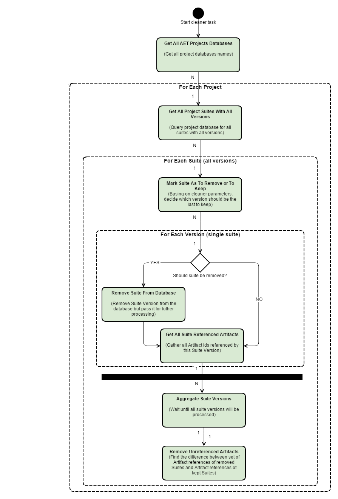

#### Examples

Let's assume we have following suite versions in the database before running the cleaner.


##### #1

After running the cleaner with the following  parameters:

* remove all suites but for the last 3 versions,
* remove all suites created before 5 days since now (assume now is 08.04.2016, so 5 days since now is 03.04.2016).

The following suites will be removed (marked red).


##### #2

After running the cleaner with the following parameters:

* remove all suites but for the last 2 versions,
* remove all suites older than 6 days (since 08.04.2016, which is 02.04.2016).

The following suites will be removed (marked red).

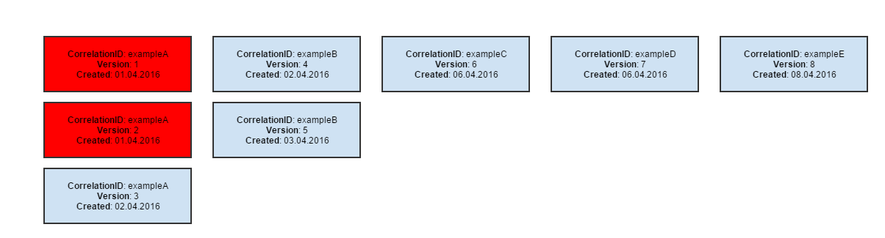

##### #3

After running the cleaner with the following parameters:

* remove all suites but for the last 2 versions,
* no date specified.

The following suites will be removed (marked red).


## Test Processing

Each AET test processing consists of two phases:

* collection,
* comparison,

After report is generated, client is notified about the finished test run.

The following diagram shows the life cycle of single test:


### Collection

This is the first phase during which all specified data will be collected (e.g. screenshots, page source, js errors). All collection results are saved in database after successful collection.

### Comparison

The second phase is operation on collected data. In some cases collected data is compared to patterns, in other special validation is performed (e.g. w3c). The second phase starts before collection finishes - just at the moment when required artefacts are collected and ready to compare (e.g. to compare two screenshots, system does not have to wait until source of page is collected).

The following diagram shows the life cycle of test suite:


## Lock Mechanism

Lock feature was implemented to block concurent modification of suite. This prevents overriding user changes (eg rebase, comments) by test suite run.

When suite is locked there is no way to update it by any operation in REST API.  

### Test suite run flow

When client (e.g. aet-maven-plugin) starts test suite then it tries to set lock by sending request to REST API.

* If given suite is already in locked state, REST API returns status 409 and then client is throwing exception and finishes execution (test suite doesn't get into runner in Queue).
* If suite isn't locked, lock is set and 'lock-heart-beat' is started. On each heartbeat lock duration is extended. Heartbeat is working until client finishes its execution.  


## Database Structure

### Overview

Each AET project has its own database. Project database consists of 3 collections:

* Metadata,
* Artifacts (files + chunks GridFS collections).

### Metadata

Metadata collection holds whole suite run with all necessary metadata. Example:

```
{
    "suite": {
        "correlationId": "cognifide-example-1234567890",
        "project": "example",
        "name": "integration",
        "version": 2,
        "tests": [
            {
                "name": "example-desktop",
                "comment": "Some test-level comment",
                "urls": [
                    {
                        "name": "unique-url-name",
                        "caseUrl": "/authors.html",
                        "canonicalUrl": "https://cognifide.com/authors.html",
                        "domain": "https://cognifide.com",
                        "comment": "Some url-level comment",
                        "useProxy": "rest",
                        "steps": [
                            {
                                "header": {
                                    "parameters": {
                                        "key": "Authorization",
                                        "value": "Basic emVuT2FyZXVuOnozbkdAckQZbiE="
                                    }
                                }
                            },
                            {
                                "open": { }
                            },
                            {
                                "screen": {
                                    "name": "desktop",
                                    "parameters": {
                                        "width": 1280,
                                        "height": 1024
                                    },
                                    "pattern": "568b54a4e63e740bfc2210e5",
                                    "result": {
                                        "artifact": "bb8b54a4e63e740bfc2210e8",
                                        "status": "OK"
                                    },
                                    "comparators": [
                                        "layout:" {
                                            "result": {
                                                "artifact": "bb8b54a4e63e740bfc2210x5",
                                                "status": {
                                                    "status": "SUCCESS",
                                                    currentCreateDate: "Mar 2, 2016 2:30:36 PM",
                                                    patternCreateDate: "Mar 2, 2016 2:30:36 PM"
                                                }
                                            }
                                        }
                                    ]
                                }
                            },
                            {
                                "screen": {
                                    "name": "desktop",
                                    "parameters": {
                                        "width": 768,
                                        "height": 1024
                                    },
                                    "pattern": "568b54a4e63e740bfc2210e5",
                                    "result": {
                                        "artifact": "aa8b54a4e63e740bfc2210e5",
                                        "status": "OK"
                                    },
                                    "comparators": [
                                        "layout:" {
                                            "result": {
                                                "artifact": "bb8b54a4e63e740bfc2210e5",
                                                "status": {
                                                    "status": "SUCCESS",
                                                    currentCreateDate: "Mar 2, 2016 2:30:36 PM",
                                                    patternCreateDate: "Mar 2, 2016 2:30:36 PM"
                                                }
                                            }
                                        }
                                    ]
                                }
                            },
                            {
                                "screen": {
                                    "name": "mobile",
                                    "parameters": {
                                        "width": 320,
                                        "height": 480
                                    },
                                    "pattern": "568b54a4e63e740bfc2210e6",
                                    "result": {
                                        "artifact": "aa8b54a4e63e740bfc2210e6",
                                        "status": "OK"
                                    },
                                    "comparators": [
                                        "layout:" {
                                            "result": {
                                                "artifact": "bb8b54a4e63e740bfc2210e5",
                                                "status": {
                                                    "status": "SUCCESS",
                                                    currentCreateDate: "Mar 2, 2016 2:30:36 PM",
                                                    patternCreateDate: "Mar 2, 2016 2:30:36 PM"
                                                }
                                            }
                                        }
                                    ]
                                }
                            },
                            {
                                "status-codes": {
                                    "comparators": [
                                        "status-codes": {
                                            "parameters": {
                                                "filterRange": "400,600"
                                            },
                                            "result": {
                                                "artifact": "bb8b54axxxxe740bfc2210e5",
                                                "status": {
                                                    "status": "SUCCESS"
                                                }
                                            }
                                        }
                                    ]
                                }
                            },
                            {
                                "js-errors": {
                                    "comparators": [
                                        "js-errors": {
                                            "dataFilters": [
                                                "js-errors-filter": {
                                                    "source": "http://w.iplsc.com/external/jquery/jquery-1.8.3.js",
                                                    "line": "2"
                                                },
                                                "result": {
                                                    "artifact": "aaab54axxxxe740bfc2210e5",
                                                    "status": {
                                                        "status": "SUCCESS"
                                                    }
                                                }
                                            ]
                                        }
                                    ]
                                }
                            }
                        ]
                    }
                ]
            }
        ]
    }
}
```

Each step defined in original suite is stored in this collection with all information necessary to run it.


**Metadata** is a simple MongoDB collection. It contains keys (objectId) of GridFS artifacts stored in **Artifacts** collection.


Metadata is persisted after full suite run. At the beginning of processing, pattern keys are fetched from the last run if it was performed.


### Artifacts

Artifacts is a GridFS collection (consists of 2 colelctions .files and .chunks). It holds binary artifacts (e.g. screenshots, source etc.). Each file has its ObjectId which is reference to it. This collection has no knowledge of its context, artifacts are not marked as pattern/result etc.


## Logs

### Overview

AET log files can be found on Apache Karaf directory, in `C:\content\karaf\data\log` folder. Logs are split into four files:

**karaf.log**

Dedicated for logging Apache Karaf activities such as starting Karaf, starting AET bundles, configurations binding, etc.

**runner.log**

Dedicated for logging AET runner activities, such as running new test, changes in test suite run lifecycle, communication between runner and workers, JMS messages management, e.t.c.

**worker.log**

Dedicated for logging AET workers activities, such as collecting, comparing, modifying data, saving data do Mongo DB, etc.

**cleaner.log**

Dedicated for logging *Cleaner* activities (removing old Artifacts from Mongo DB, etc.).

### Log structue

Each log record has common structure:

```
    1                       2       3                           4                               5       6
2015-03-19 15:22:26,307 | INFO  | worker                   | CollectorMessageListenerImpl       86 | CollectorJobData [Collector4] message arrived with 1 urls. CorrelationId: cognifide-project-test-suite-1426774946010 RequestMessageId: ID:FLANNEL-56766-1426771932253-1:1:1:1:2
2015-03-19 15:22:28,650 | INFO  | worker                   | CollectorDispatcherImpl            41 | Start collection from http://www.cognifide.com, with 4 steps to perform. Company: cognifide Project: project TestSuite: test-suite Test: test1
2015-03-19 15:22:28,651 | DEBUG | worker                   | CollectorDispatcherImpl            53 | Performing collection step 1/4: open named open with parameters: {} from http://www.cognifide.com. Company: cognifide Project: project TestSuite: test-suite Test: test1
2015-03-19 15:22:29,351 | DEBUG | worker                   | CollectorDispatcherImpl            53 | Performing collection step 2/4: sleep named sleep with parameters: {duration=1500} from http://www.cognifide.com. Company: cognifide Project: project TestSuite: test-suite Test: test1
2015-03-19 15:22:29,351 | DEBUG | job-common               | SleepModifier                      27 | Sleeping for 1500 milliseconds
2015-03-19 15:22:30,851 | DEBUG | worker                   | CollectorDispatcherImpl            53 | Performing collection step 3/4: screen named screen with parameters: {} from http://www.cognifide.com. Company: cognifide Project: project TestSuite: test-suite Test: test1
2015-03-19 15:22:31,804 | DEBUG | datastorage-gridfs-impl  | GridFsStorage                     600 | Saving node with key: PatternMetadata{company=cognifide, project=project, testSuiteName=test-suite, environment=win7-ff16, artifactType=PATTERNS, domain=null, version=null} and file name: result.json
2015-03-19 15:22:31,813 | INFO  | datastorage-gridfs-impl  | GridFsHelper                      428 | Index created; Database: cognifide; Collection: project.files
2015-03-19 15:22:31,814 | DEBUG | datastorage-gridfs-impl  | GridFsStorage                     600 | Saving node with key: PatternMetadata{company=cognifide, project=project, testSuiteName=test-suite, environment=win7-ff16, artifactType=PATTERNS, domain=null, version=null} and file name: screenshot.png
...
```

where:

1. Log record date and hour,
2. Log level (INFO, DEBUG or ERROR),
3. Name of the system module where information is logged,
4. Name of the class,
5. Line of code,
6. Log message.

### Logs configuration

AET logging can be configured in *org.ops4j.pax.logging.cfg* file in *C:\content\karaf\data\etc* folder.

This configuration file specifies among others log files destination folder, log level and  pattern, log file maximum size.


### What's new
AET 2.0 brings new reporting capabilities and improved performance. We have decided to label the new features as BETA and 
improve them based your feedback as it means a lot to us. Stay tuned!

#### Architecture performance improvements
We keep evolving the AET architecture and optimizing reporting performance. We have introduced new web application reports, 
which are now generated on the client-side. Also, we have optimized database model queries and decreased number of calls by a factor of 10. 
If you’ve ever been working on a release and discovered that the AET database has become overloaded, we have removed data storage duplications so you 
don’t need to worry any longer!

#### New reporting interface BETA
The reporting interface has been turned into a modern and responsive client-side application. 
Now it’s easy to search and filter results from your test case. If you are tired of re-running your tests after 
accepting patterns don’t worry, now all changes are applied on the fly. Additionally you can share a link to a test result 
that you are concerned about and share with your team just by copying the test URL and pasting to JIRA.

#### Accessibility report BETA
AET 2.0 introduces an accessibility report that displays validation output of page accessibility analysis using the 
[HTML_CodeSniffer](http://squizlabs.github.io/HTML_CodeSniffer/) library. Results show the total count of errors, warnings and notice type violations.

#### Client-side performance BETA
Now it’s possible to test client-side performance in an agile and incremental fashion. Brand new reports show overall scores along with a 
list of rules with individual grades. The performance analysis is based on the [YSlow](http://yslow.org/) tool.

## Migrate AET Suite to AET 2.0
### Preparing the suite XML
You should perform the following changes in your project suite XML:

* remove the `environment="win7-ff16` property from the `suite` tag,

  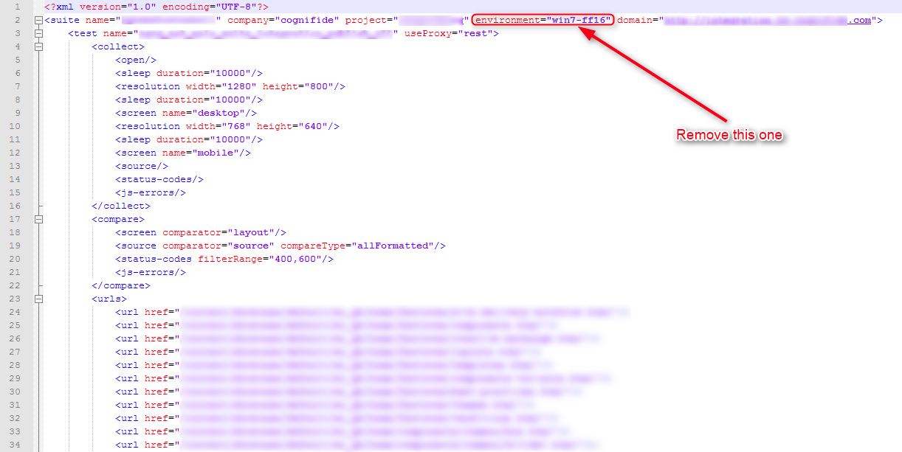
  
* remove the whole `<reports>` selection from XML,

  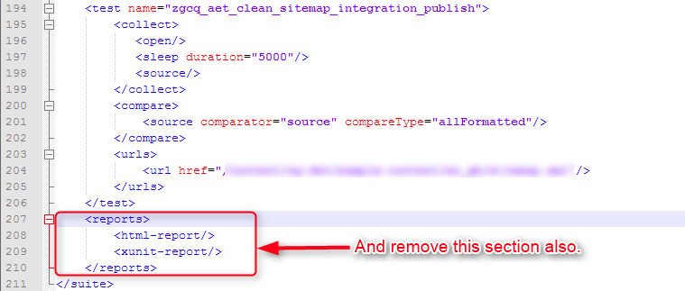
  
| ! Important information |
|:----------------------- |
|From this AET version, html reports are no longer generated as static files but are served by dynamic web application. If you still need a xunit report please update your aet run command with the parameter `xUnit=true`. See more in [[Client Application|ClientApplication]]. |

  
* check your `screen` collector definition, remove deprecated parameters: `maximize`, `width`, `height` (see  the [[Screen Collector|ScreenColector]] documentation for recommended changes),

  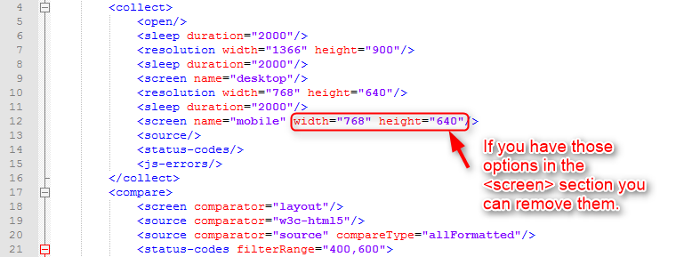
  
* stop using the `w3c` comparator, use `w3c-html5` instead,

  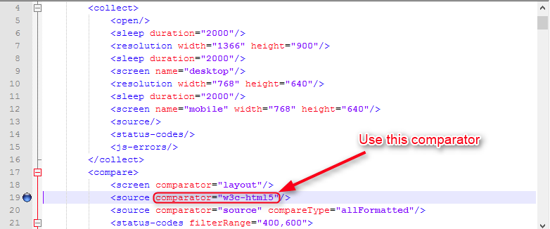
  
* [OPTIONAL] in `w3c-html5` use the `ignore-warnings` parameter instead of the `errors-only`parameter in `w3c-html5`).
